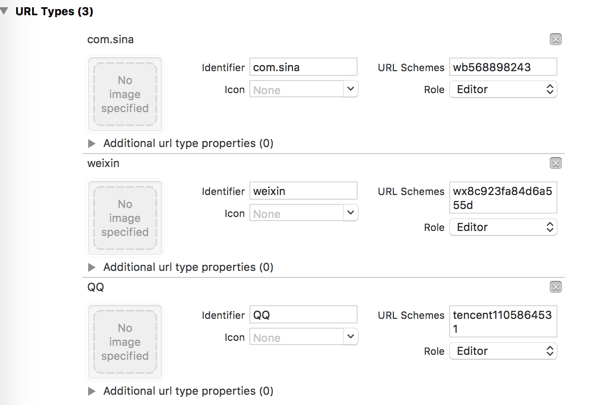

# iOS JShare 对外集成文档
##使用提示
本文是 JSHARE iOS SDK 的标准集成指南文档。
匹配的 SDK 版本为：V1.3.0及以后版本。

* 如果你想要快速测试、请参考本文在几分钟内跑通 Demo。
* 极光文档官网上有相关的所有指南、API、教程等全部的文档。包括本文档的更新版本，都会及时地发布到该网站上。

## 产品功能说明
JSHARE SDK 可以让你的应用支持多平台分享，无需花耗时间了解、集成每个社会化分享平台的 SDK，可以有效的降低包体积。

### 主要场景：

* 将分享内容分享到 QQ、微信、新浪微博三个主要的社交平台。
* 获取QQ、微信、新浪微博三个主要平台的个人信息，用于第三方登录。
* 分享内容到 Facebook 和 Messenger，以及获取 Facebook 用户的个人信息用于第三方登录。

### 集成压缩包内容

* jshare-ios-x.x.x.a 静态库
* jcore-ios-x.x.x.a 静态库
* JSHARE SDK 入口 JSHAREService.h 头文件
* 一个完整的 iOS Demo 项目工程，这个工程演示了 JSHARE SDK 的基本用法，配置 SDK 时建议参考这个 Demo。

### iOS SDK 支持版本
目前 JSHARE 只支持 iOS 7 及以上 iOS 版本。

## 快速体验
* 双击压缩包里面的 JShareDemo.xcodeproj 打开 Demo；
* 修改 AppDelegate.m 里面的 appKey 的值;
* 在项目的【General】页面 -> 【Identity】->【Bundle Identifier】 选项填写你在极光创建应用所上传的证书的 Bundle id;
* 运行安装 Demo 到真机。


## JSHARE SDK 集成步骤

* 解压压缩包，将 Lib 下的所有文件复制到工程中，即可开始使用 SDK。

* 增加相关的 framework 依赖：

	* UIKit
	* SystemConfiguration
	* CoreTelephony
	* CoreGraphics
	* Security
	* Foundation
	* CoreLocation
	* CoreFoundation
	* CFNetwork
	* libz.tbd
	* libresolv.tbd

* 在 AppDelegate.m 引用头文件的位置


```
// 引入 JSHARE 功能所需头文件
#import "JSHAREService.h"
// 如果需要使用 idfa 功能所需要引入的头文件（可选）
#import <AdSupport/AdSupport.h>
```

## SDK 主要接口说明
JSHARELaunchConfig 类：JSHARE SDK 启动配置模型。

JSHAREService 类，包含分享 SDK 的所有接口。


### method - setupWithConfig
#### 接口定义：
+(void)setupWithConfig:(JSHARELaunchConfig *)config<br>
#### 接口说明：
初始化接口。建议在 application:didFinishLaunchingWithOptions: 中调用。
#### 参数说明：
* config：JSHARELaunchConfig 类的实例。

#### 调用示例：

```
    JSHARELaunchConfig *config = [[JSHARELaunchConfig alloc] init];
    config.appKey = @"AppKey copied from JiGuang Portal application";
    config.SinaWeiboAppKey = @"374535501";
    config.SinaWeiboAppSecret = @"baccd12c166f1df96736b51ffbf600a2";
    config.SinaRedirectUri = @"https://www.jiguang.cn";
    config.QQAppId = @"1105864531";
    config.QQAppKey = @"glFYjkHQGSOCJHMC";
    config.WeChatAppId = @"wxa2ea563906227379";
    config.WeChatAppSecret = @"bb63c0a06bf0ee7f633a5bc44304d110";
    config.FacebookAppID = @"1847959632183996";
    config.FacebookDisplayName = @"JShareDemo";
    [JSHAREService setupWithConfig:config];
    [JSHAREService setDebug:YES];

```

### method - share
####接口定义：
+(void)share:(JSHAREMessage *)message
      handler:(JSHAREStateHandler)handler

#### 参数说明：

* message：JSHAREMessage 类的实例
* handler：JSHAREStateHandler 分享后的回调

#### 调用示例：

```
JSHAREMessage *message = [JSHAREMessage message];
    message.text = @"JShare SDK 支持主流社交平台、帮助开发者轻松实现社会化功能！";
    message.platform = JSHAREPlatformQQ;
    message.mediaType = JSHAREText;
    [JSHAREService share:message handler:^(JSHAREState state, NSError *error) {
          NSLog(@"分享回调");
        }
    }];
```

### method - handleOpenUrl
#### 接口定义：
+(BOOL)handleOpenUrl:(NSURL *)url
#### 接口说明：
分享的回调接口，必要！

iOS 9以下，在 Appdelegate 的 application:handleOpenURL: 中调用;
iOS 9以上，在 Appdelegate 的 application: openURL: options 中调用。
#### 参数说明：

* url：回调的 url。

#### 调用示例：

```
//目前适用所有 iOS 系统
- (BOOL)application:(UIApplication *)application handleOpenURL:(NSURL *)url{
    [JSHAREService handleOpenUrl:url];
    return YES;
}

//仅支持 iOS9 以上系统，iOS8 及以下系统不会回调
- (BOOL)application:(UIApplication *)app openURL:(NSURL *)url options:(NSDictionary<UIApplicationOpenURLOptionsKey, id> *)options {
    [JSHAREService handleOpenUrl:url];
    return YES;
}

```
### method - getSocialUserInfo
#### 接口定义：
+(void)getSocialUserInfo:(JSHAREPlatform)platform
                  handler:(JSHARESocialHandler)handler

#### 接口说明：
通过调用获取用户信息接口，获取用户在第三方平台的用户 ID、头像等资料完成账号体系的构建。

#### 参数说明：

* platform : JSHAREPlatform 枚举类型。
* handler : JSHARESocialHandler 获取用户信息的回调。

#### 调用实例：

```
[JSHAREService getSocialUserInfo:platfrom handler:^(JSHARESocialUserInfo *userInfo, NSError *error) {
        NSString *alertMessage;
        NSString *title;
        if (error) {
            title = @"失败";
            alertMessage = @"无法获取到用户信息";
        }else{
            title = userInfo.name;
            alertMessage = [NSString stringWithFormat:@"昵称: %@\n 头像链接: %@\n 性别: %@\n",userInfo.name,userInfo.iconurl,userInfo.gender == 1? @"男" : @"女"];
        }
        UIAlertView *Alert = [[UIAlertView alloc] initWithTitle:title message:alertMessage delegate:nil cancelButtonTitle:@"OK" otherButtonTitles:nil];
        dispatch_async(dispatch_get_main_queue(), ^{
            [Alert show];
        });


    }];
```

其他接口详见 JSHAREService.h 。


## Xcode 中的设置

### 配置 ApplicationQueriesSchemes
在 iOS9/10 下就需要增加一个应用可跳转的白名单，即 LSApplicationQueriesSchemes，否则将在 SDK 判断是否跳转时用到的canOpenURL 时返回 NO，进而只进行 webview 分享/分享失败。

在项目中的 info.plist 中加入应用白名单：

* 右键 info.plist
* 选择 source code
* 添加如下内容：

```
<key>LSApplicationQueriesSchemes</key>
<array>
    <!-- 微信 URL Scheme 白名单-->
    <string>wechat</string>
    <string>weixin</string>

    <!-- 新浪微博 URL Scheme 白名单-->
    <string>sinaweibohd</string>
    <string>sinaweibo</string>
    <string>sinaweibosso</string>
    <string>weibosdk</string>
    <string>weibosdk2.5</string>

    <!-- QQ、Qzone URL Scheme 白名单-->
    <string>mqqapi</string>
    <string>mqq</string>
    <string>mqqOpensdkSSoLogin</string>
    <string>mqqconnect</string>
    <string>mqqopensdkdataline</string>
    <string>mqqopensdkgrouptribeshare</string>
    <string>mqqopensdkfriend</string>
    <string>mqqopensdkapi</string>
    <string>mqqopensdkapiV2</string>
    <string>mqqopensdkapiV3</string>
    <string>mqqopensdkapiV4</string>
    <string>mqzoneopensdk</string>
    <string>wtloginmqq</string>
    <string>wtloginmqq2</string>
    <string>mqqwpa</string>
    <string>mqzone</string>
    <string>mqzonev2</string>
    <string>mqzoneshare</string>
    <string>wtloginqzone</string>
    <string>mqzonewx</string>
    <string>mqzoneopensdkapiV2</string>
    <string>mqzoneopensdkapi19</string>
    <string>mqzoneopensdkapi</string>
    <string>mqqbrowser</string>
    <string>mttbrowser</string>
    
    <!-- Facebook URL Scheme 白名单-->
    <string>fbapi</string>
    <string>fb-messenger-api</string>
    <string>fbauth2</string>
    <string>fbshareextension</string>
</array>
```

### 添加 URL Types
#### 各个平台的 URL Schemes 格式说明：

|平台 | 格式 | 举例 |
|------------ | ------------- | ------------- |
|微信 | 微信 appKey | wxa2ea563906227379|
|QQ | 需添加：“tencent” + 腾讯 QQ 互联应用 appID | 如 appID 为:1105864531<br> URL Schemes 值为:tencent1105864531|
|新浪微博 | “wb”+新浪 appKey | 如 appKey 为:727232518<br>URL Schemes 值为: wb727232518 |
|Facebook | “fb”+FacebookAppID | 如 appID 为:1847959632183996<br>URL Schemes 值为: fb1847959632183996 |


#### URL Types 设置  
Xcode 工程目录中的 [TARGETS] -> [Info] 中设置：


### HTTPS 设置
 > Apple 将从2017年开始执行 ATS(App Transport Security)，所有进行审核的应用中网络请求全部支持 HTTPS，届时以下配置将会失效，请提前做好准备。

  目前 JSHARE 支持不存在新浪微博客户端情况下的网页分享，但是由于新浪微博的 api 尚未针对 https 做优化所以需要针对新浪的做对应的 https 设置。在 JSHARE 中是默认关闭新浪微博的网页端分享的，如需使用这个功能则需要在 JSHARELaunchConfig 类的实例中将 **isSupportWebSina** 属性设置为 YES。

  以iOS10 SDK 编译的工程会默认以 SSL 安全协议进行网络传输，即 HTTPS，如果依然使用 HTTP 协议请求网络会报系统异常并中断请求。目前可用如下这种方式保持用 HTTP 进行网络连接：

在 info.plist 中加入安全域名白名单(右键 info.plist 用 source code 打开)

```
<key>NSAppTransportSecurity</key>
<dict>
    <!-- 配置允许 http 的任意网络 End-->
   <key>NSExceptionDomains</key>
   <dict>
       <!-- 集成新浪微博对应的 HTTP 白名单-->
       <key>sina.com.cn</key>
       <dict>
           <key>NSIncludesSubdomains</key>
           <true/>
           <key>NSThirdPartyExceptionAllowsInsecureHTTPLoads</key>
           <true/>
           <key>NSThirdPartyExceptionRequiresForwardSecrecy</key>
           <false/>
       </dict>
       <key>sinaimg.cn</key>
       <dict>
           <key>NSIncludesSubdomains</key>
           <true/>
           <key>NSThirdPartyExceptionAllowsInsecureHTTPLoads</key>
           <true/>
           <key>NSThirdPartyExceptionRequiresForwardSecrecy</key>
           <false/>
       </dict>
       <key>sinajs.cn</key>
       <dict>
           <key>NSIncludesSubdomains</key>
           <true/>
           <key>NSThirdPartyExceptionAllowsInsecureHTTPLoads</key>
           <true/>
           <key>NSThirdPartyExceptionRequiresForwardSecrecy</key>
           <false/>
       </dict>
       <key>sina.cn</key>
       <dict>
           <!-- 适配 iOS10 -->
           <key>NSExceptionMinimumTLSVersion</key>
           <string>TLSv1.0</string>
           <key>NSIncludesSubdomains</key>
           <true/>
           <key>NSThirdPartyExceptionRequiresForwardSecrecy</key>
           <false/>
       </dict>
       <key>weibo.cn</key>
       <dict>
           <!-- 适配 iOS10 -->
           <key>NSExceptionMinimumTLSVersion</key>
           <string>TLSv1.0</string>
           <key>NSIncludesSubdomains</key>
           <true/>
           <key>NSThirdPartyExceptionRequiresForwardSecrecy</key>
           <false/>
       </dict>
       <key>weibo.com</key>
       <dict>
           <!-- 适配 iOS10 -->
           <key>NSExceptionMinimumTLSVersion</key>
           <string>TLSv1.0</string>
           <key>NSIncludesSubdomains</key>
           <true/>
           <key>NSThirdPartyExceptionAllowsInsecureHTTPLoads</key>
           <true/>
           <key>NSThirdPartyExceptionRequiresForwardSecrecy</key>
           <false/>
       </dict>
       <!-- 新浪微博-->
   </dict>
</dict>
```

#end

