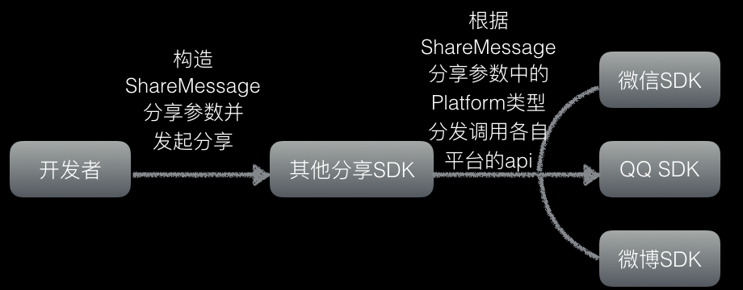
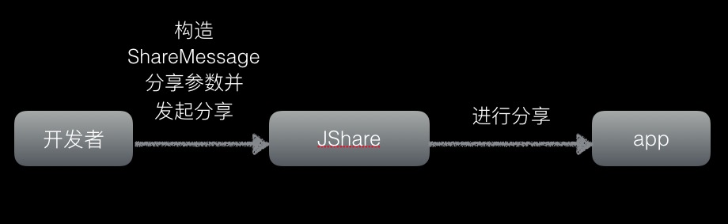

#JShare 产品介绍

极光 Share 致力于帮助应用快速具备国内外主流社交平台分享和第三方登录功能，提供新浪微博、QQ、微信、Facebook 等第三方社会化服务；SDK 包体积小，集成成本低，提供 iOS 和 Android 的 SDK ，并且还提供了统计功能，方便开发者了解应用的分享效果，提高产品推广效率，助力产品获得更多用户。

##JShare 技术原理

目前市面上依赖平台原生 SDK 的分享 SDK 皆为这种形式：
但是，极光 Share 技术上不依赖原生 SDK 的方式，分享的原理实际上就是两个 APP 之间的相互跳转和通信，使用极光 Share 代替平台 SDK 实现分享，其原理如下图：个别平台如新浪微博在不存在目标 app 的情况下则会进入网页分享。JShare SDK 分享遵循以下步骤：

1.注册 Appkey。 
2.配置分享参数。 
3.发起分享。 
4.等待回调。 

##功能与特性

1.集成简单 
&emsp;&emsp;只需几分钟即可集成 JShare 组件，让您的应用轻松拥有强大的社会化功能。 
2.稳定，安装包小 
&emsp;&emsp;不依赖第三方平台的库包，极大的减少 SDK 的体积。 
3.社会化统计分析 
&emsp;&emsp;完整的统计和分析后台，帮助开发者了解各项统计指标。 
4.一键分享 
&emsp;&emsp;通过组件对新浪微博、QQ、微信、Facebook 等社会化平台一键分享；分享内容包括文字、图片、链接、音视频、文件、表情等。 
5.第三方登录 
&emsp;&emsp;使用 QQ、新浪微博、微信、Facebook 等社交平台账号登录APP更快捷。 

##集成流程

在 Web 控制台上创建应用，得到 Appkey。如果之前已经使用了 JPush，可以直接延用老的 Appkey。

集成客户端 SDK。 
Android 开发者请参考文档:[JShare Android SDK 集成指南](../client/Android/android_sdk.md) 
IOS 开发者请参考文档：[JShare iOS SDK 集成指南](../client/iOS/ios_sdk.md) 

###相关文档
[JShare Android SDK 接口文档](../client/Android/android_api.md) 
[JShare iOS SDK 接口文档](../client/iOS/ios_api.md)

##技术支持
当出现问题时：

+ 请仔细阅读文档，查看是否有遗漏。 [Android FAQ](../client/Android/android_sdk_faq/)  [iOS FAQ](../client/iOS/ios_sdk_faq/)
+ 给我们的support发邮件：<support@jpush.cn>

为了更快速的解决问题，在寻求帮助时，请提供下列信息：

+ 使用的什么 API 的接口
+ 如果是 SDK 问题请提供对应的 SDK 版本和完整的日志记录

