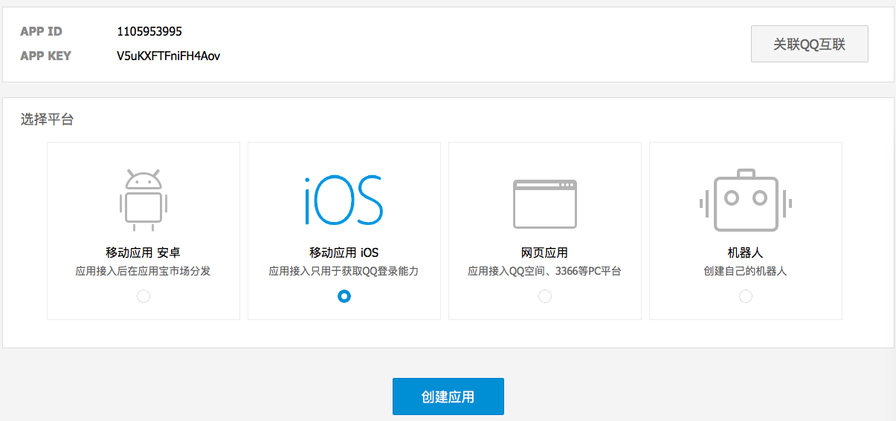
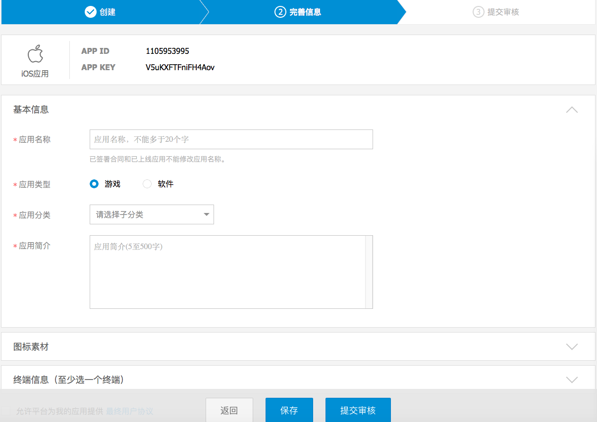
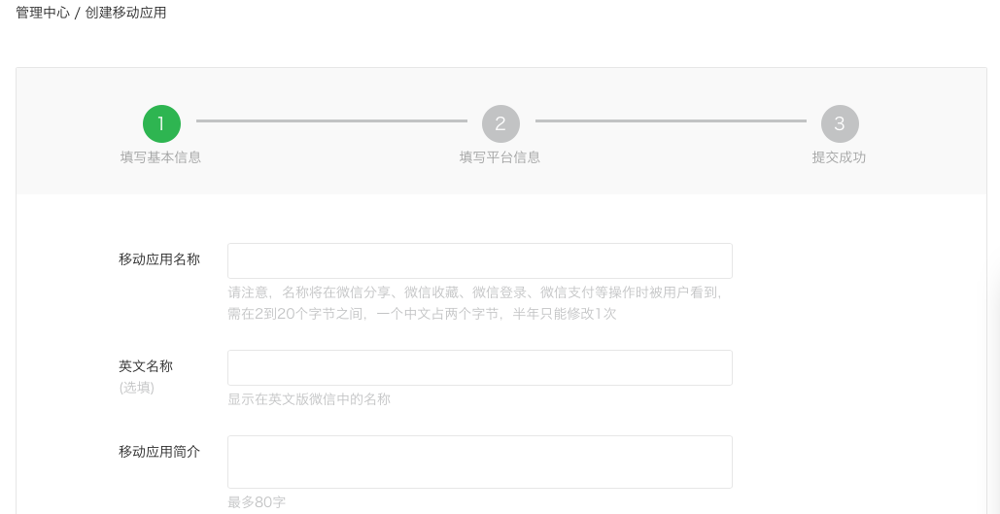
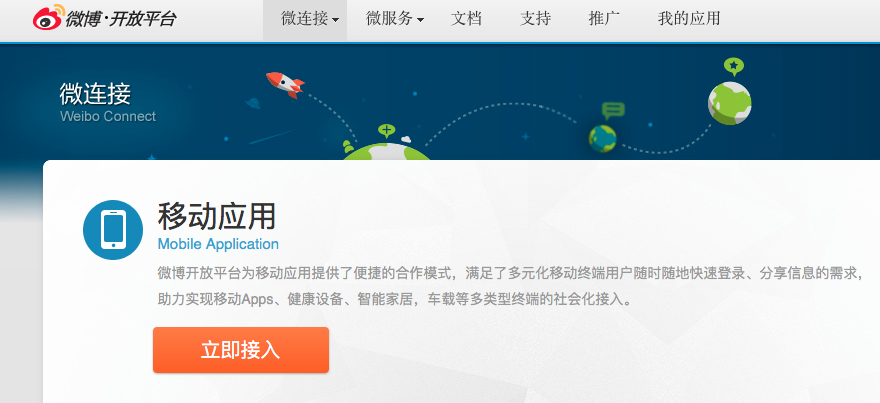
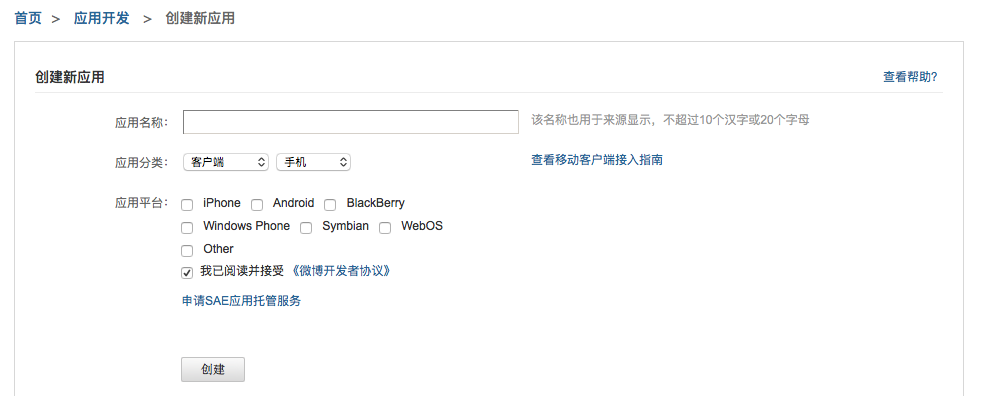
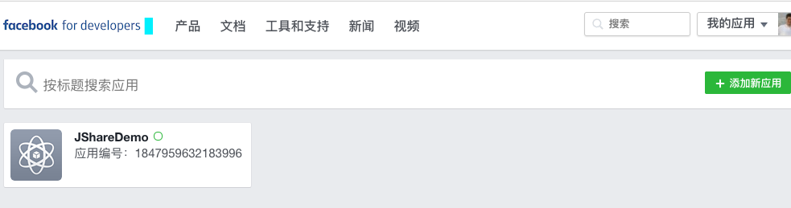

# 第三方平台申请
##为什么需要申请第三方平台帐号？
应用在分享到 QQ，微信和新浪微博分享成功后显示的应用信息、应用名称、应用图标等信息跟第三方开放平台设置有关，因此需要在第三方开放平台创建应用并审核通过。
## 申请 QQ 的 appID

登录腾讯开放平台,应用接入(<a href="http://op.open.qq.com/appregv2/">点击链接</a>） ，根据需要选择 Android 应用或者 iOS 应用，

点击创建应用，填写相关应用信息并提交审核，

根据提示填写应用信息，应用未通过审核前只能使用测试账号。

## 申请微信 appID
登录<a href="https://open.weixin.qq.com/">微信开发者平台</a>，进入管理中心,点击创建移动应用，根据提示填写应用的基本信息以及平台信息

提交审核，审核通过后即可获得 appID 和 appsecret；至此，应用已具有分享的能力，如果还需要使用微信登录功能，开发者还需要申请微信平台的开发者资质认证。 
需要特别注意的是在申请时填写的包名和签名必须与 apk 文件相对应。

## 申请新浪微博 appkey
登录<a href="http://open.weibo.com"/>新浪微博开放平台</a>,进入微链接－》移动应用，点击立即接入创建应用

根据提示填写应用信息创建新应用

提交审核，审核通过后即可获得 appkey 和 appsecret。 
需要特别注意的是在申请时填写的包名和签名必须与 apk 文件相对应。

## 申请 Facebook 的 appID
登录 Facebook 开发者平台,点击添加新应用(<a href="https://developers.facebook.com/apps/">点击链接</a>） ，根据需要选择 Android 应用或者 iOS 应用，

填写相关应用信息并提交审核，

根据提示填写应用信息即可。