#控制台操作指南
##开发者认证
因运营商要求，短信业务需完成个人实名认证或企业资质认证后使用。
###个人认证
支持个人开发者认证，认证内容均必填，且认证通过后不允许修改，请认真填写个人认证资料，避免影响日后使用短信业务。
####操作路径
Step1：登入控制台  
Step2：进入账号  
Step3：右侧菜单中选择［开发者认证］  
Step4：开发者类型选择［个人］  
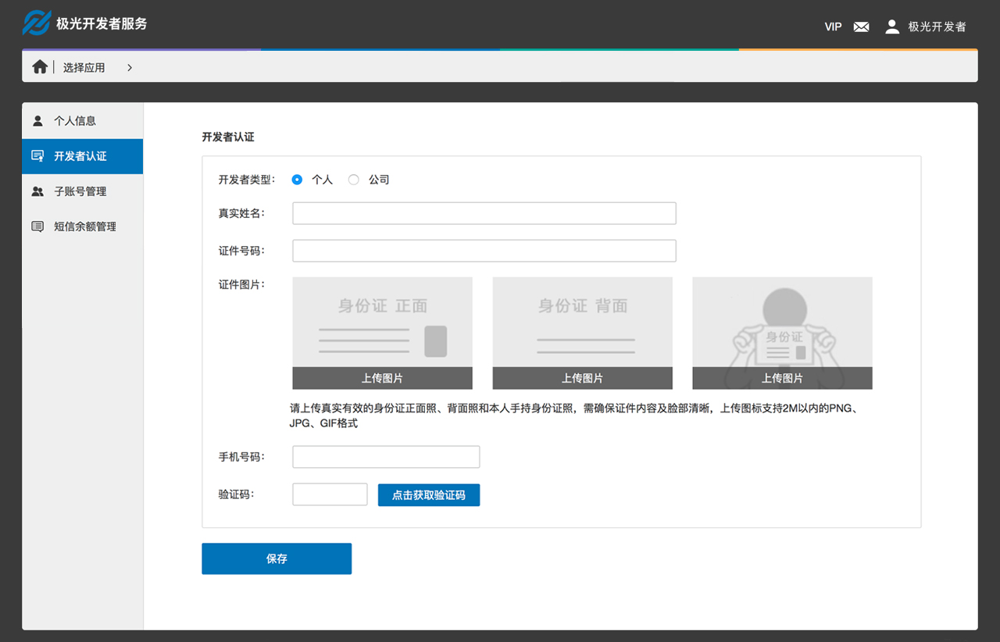

###企业认证
支持企业开发者认证，认证内容均必填，且认证通过后不允许修改，请认真填写企业认证资料，避免影响日后使用短信业务。
####操作路径
Step1：登入控制台  
Step2：进入账号  
Step3：右侧菜单中选择［开发者认证］  
Step4：开发者类型选择［企业］ 
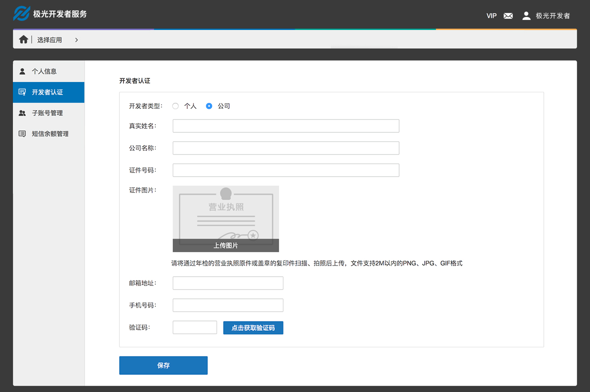

##创建应用
####操作步骤
Step1：登入控制台  
Step2：点击［创建应用］按钮  
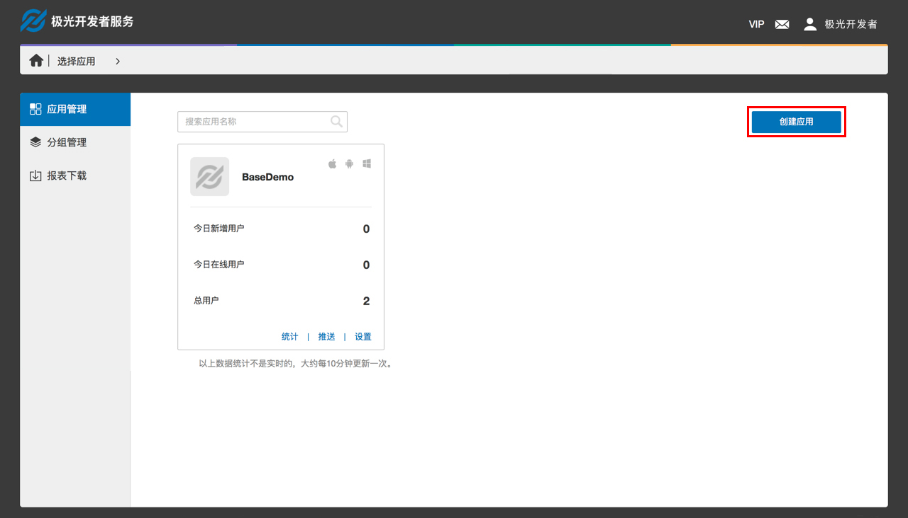  

Step3：填写［应用名称］和［应用图标］，其中［应用名称］为必填。  
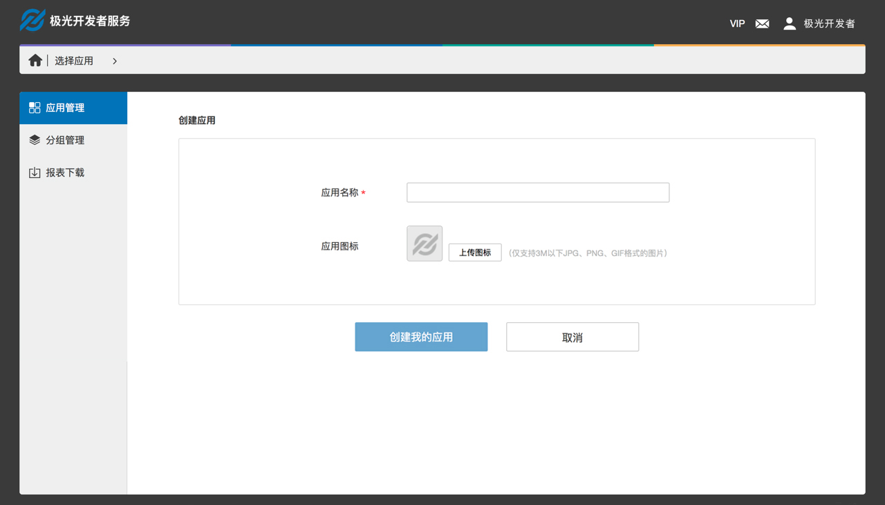

##签名设置
签名显示在短信内容的最前面，示意这条短信来自哪家公司，哪款产品或哪个软件。因运营商要求，签名需通过审核后使用，正常情况下审核周期为两个工作日。
####操作路径
Step1：登入控制台  
Step2：进入短信业务模版  
Step3：右侧菜单中选择［签名管理］  
Step4：点击［新建签名］按钮  
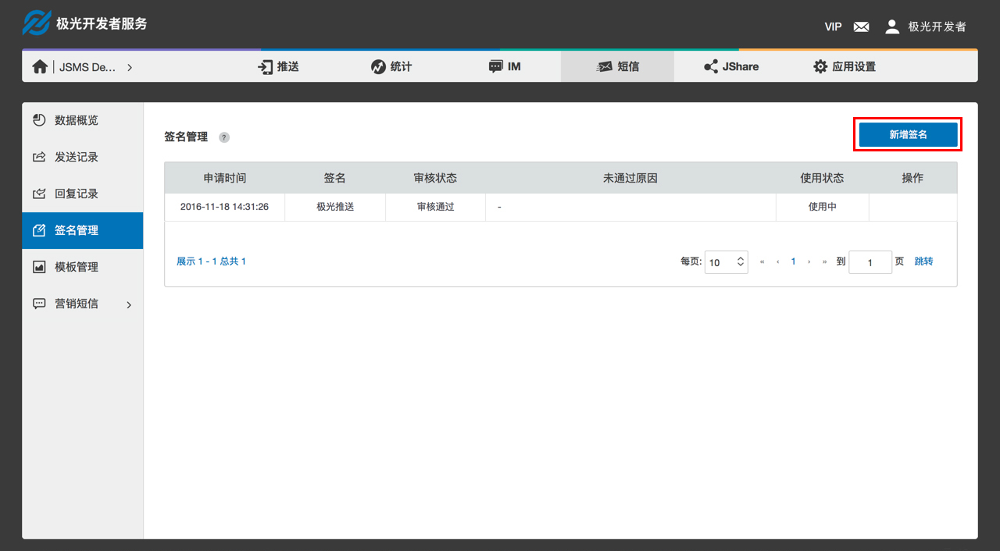

####创建签名
* 签名支持上传 2～10 个中英文或数字，不允许输入空格或特殊符号;  
* 当签名签名与开发者认证信息不一致时，请上传签名相关证件图片;
* 若已有使用中签名，创建的新签名通过审核后将直接替换老签名。  

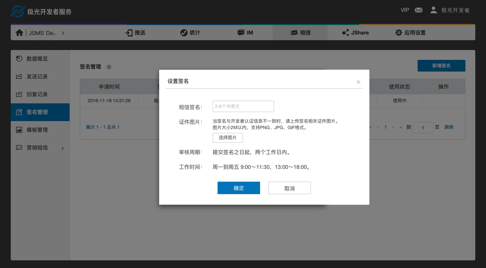

##模板设置
模板为带参数的短信内容，API 调用时直接填写模板 ID 和对应的参数内容即可。因运营商要求，模板需通过审核后才可使用，正常情况下审核周期为工作时间三小时内。
###操作路径
Step1：登入控制台  
Step2：进入短信业务模板  
Step3：右侧菜单中选择［模板管理］  
Step4：点击［新建模板］按钮  
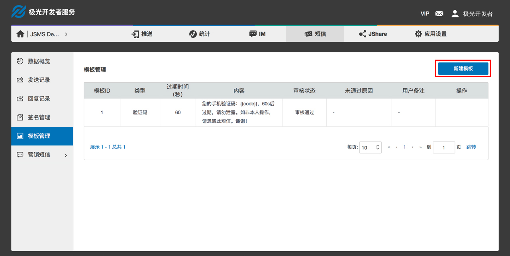

###创建模板
* 模板类型：支持创建文本验证码类短信模板、通知类短信模板和营销类短信模板；
* 模版格式：模板中参数格式为  {{key-name}}，其中分隔符采用两个大括号；
* 验证码类模板：参数名必须为code，当设置多个参数，参数名必须全为code，验证码类模版中支持设置验证码有效期，有效期必须在0～24小时之间，单位为秒；  
 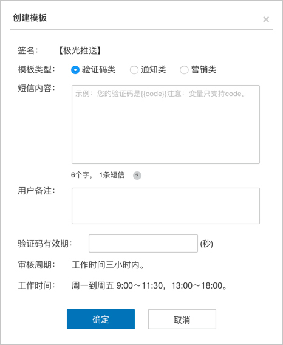
 
* 通知类模板：模板中必须至少包含一个参数，参数名由开发者指定，仅支持字母及下划线，且下划线不允许在开头和结尾；  
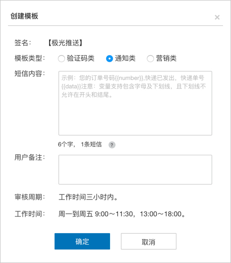

* 营销类模板：模板中必须至少包含一个参数，参数名由开发者指定，仅支持字母及下划线，且下划线不允许在开头和结尾，根据运营商规定，营销短信内容中必须包含退订相关信息，系统已默认添加“回TD退订”，模板中可不填写；  
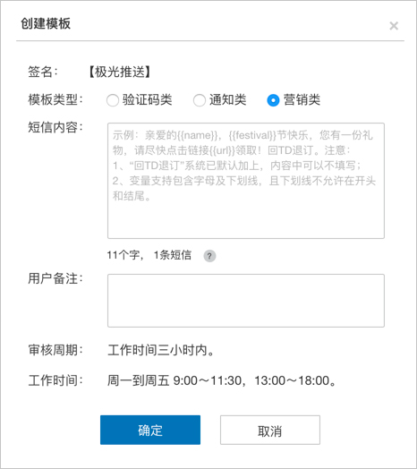

* 默认模版：目前仅验证码类短信模版有默认模版，当未设置签名时，默认模版使用［极光推送］的签名。

##营销短信
营销短信除了可以通过调用 API 发送，还可以在网站发送，并且支持定时发送。
###创建营销短信
####操作路径
Step1：登入控制台  
Step2：进入短信业务模版  
Step3：右侧菜单中选择［营销短信］中的［预发送列表］  
Step4：点击［创建营销短信］按钮  
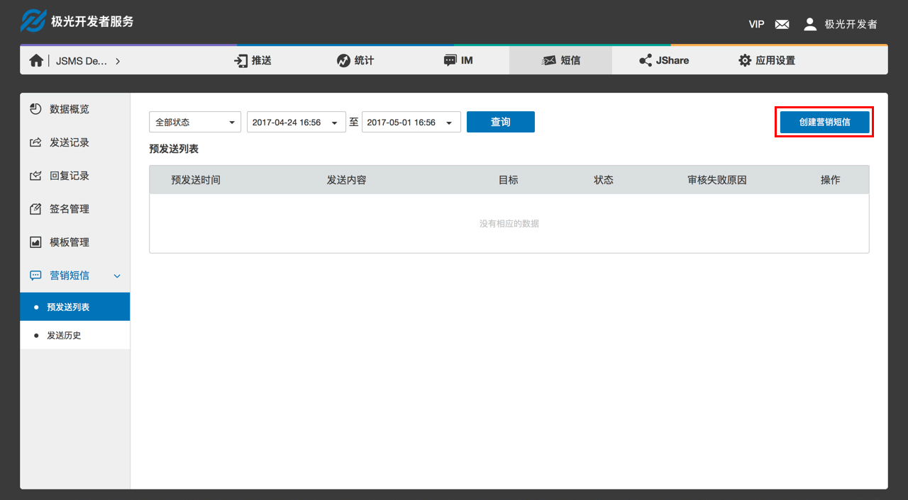
     
####创建营销短信
 
* 签名将自动写入使用中的签名，若未设置签名，请先设置签名在创建营销短信；
* 短信内容：输入短信内容，根据运营商规定，营销短信内容中必须包含退订相关信息，系统已默认添加“回TD退订”，内容中可不填写；
* 发送时间：支持即使发送或定时发送，营销短信通过审核后将按照预定时间发送；
* 接受人群：上传txt文件，一个手机号一行；
* 全部填写完，点击下一步，确认信息无误后，点击确认，创建成功并冻结对应余量。  

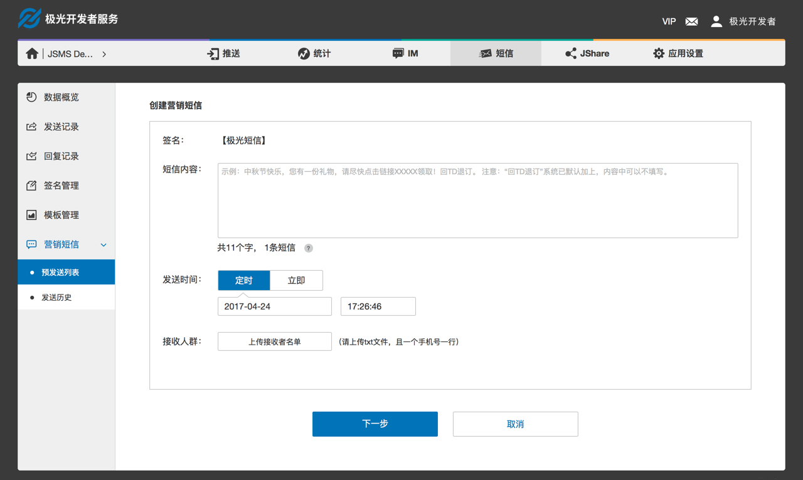

查看预发送列表 
可查看营销短信审核结果，和未到发送时间｀的营销短信。
##查看数据
* 数据概览可查看该应用数据，包括短信余量，发送量和消耗量；
* 所有类型的短信，包括：验证码类、通知类、营销类和推送补充类的发送记录可在发送记录中查看；
* 收到的所有上行短信记录可在回复记录中查看；
* 营销短信发送记录也可以在营销短信的发送历史中查看。  