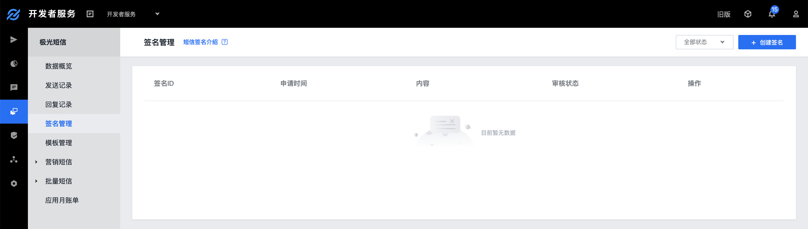
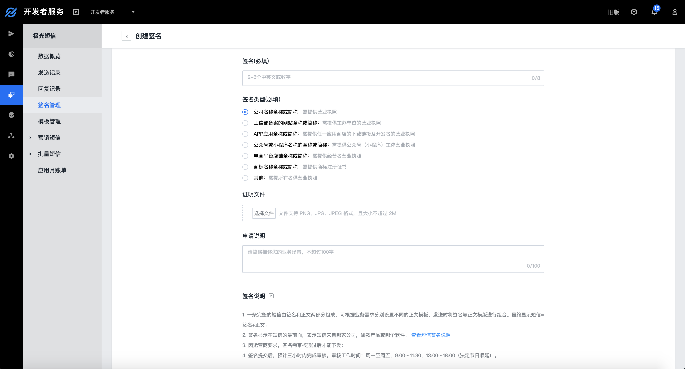
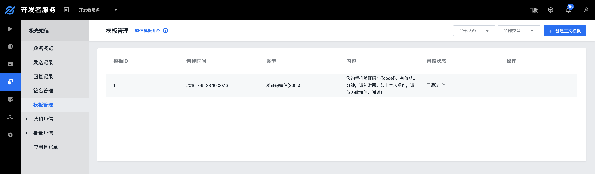
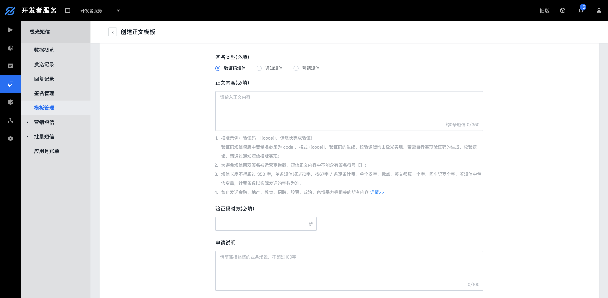
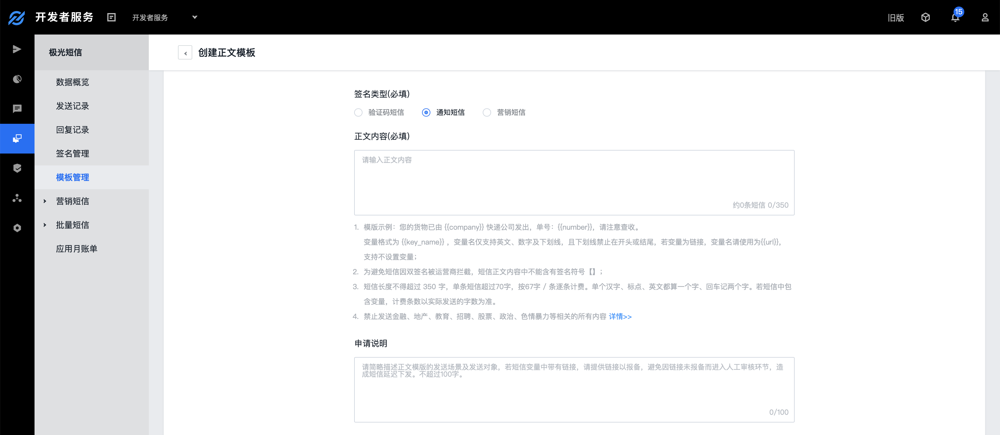
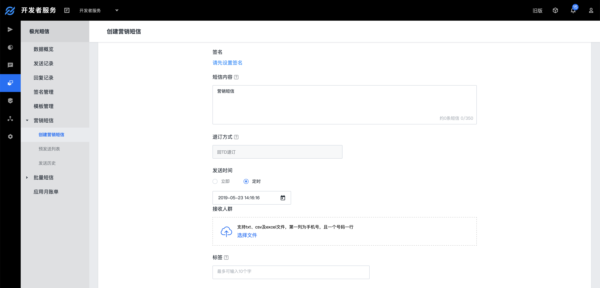
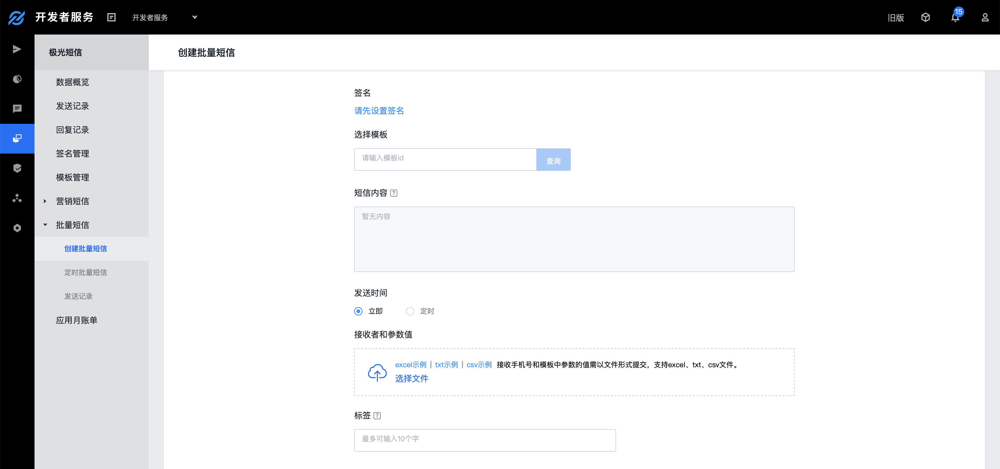

#控制台操作指南

在使用极光短信服务前，需创建应用，应用创建成功后您可获得该应用的唯一标识码 AppKey ，调用短信 Rest API 时，需使用 Appkey 与 MasterSecret 完成访问鉴权。

同时，开发者可在应用下创建短信签名和正文模版，[点击查看短信签名和正文模版说明](https://docs.jiguang.cn//jsms/guideline/jsms_terminology/) 。

##创建应用
* 登录 [极光开发者服务控制台](https://www.jiguang.cn/dev2/#/overview/appCardList) ，点击［创建应用］按钮

  

* 填写［应用名称］和［应用图标］即可，其中［应用名称］为必填。  

##签名管理
* 签名管理中可查看已创建的签名，并找到创建签名的入口。

###创建签名
* 签名支持上传 2～8 个中英文或数字，不允许输入空格或特殊符号; 
* 签名类型可根据签名来源选择，证明文件必须与所选的签名类型一致；

##模板管理
* 模版管理中可查看已创建的模版，并找到创建签名的入口，极光已提供一个通用模版供开发者使用，通用模版已通过审核可直接使用。

##创建模板
* 支持创建文本验证码短信正文模板、系统通知短信正文模板和营销推广短信正文模板；

###文本验证码短信正文模版
* 正文内容中的变量名必须为code，当设置多个变量时，变量名必须全为code，格式{{code}} ；
* 验证码有效期可输入范围[0~86400]，单位为秒。 

 
###系统通知短信正文模版
* 正文内容中的变量格式为  {{key_name}}，其中分隔符采用两个大括号，变量名仅支持英文、数字及下划线，且下划线不允许在开头或结尾。

###营销推广短信正文模板
* 正文内容中的变量格式为  {{key_name}}，其中分隔符采用两个大括号，变量名仅支持英文、数字及下划线，且下划线不允许在开头或结尾；
* 根据运营商规定，营销短信必须包含退订相关内容，系统已默认添加，模板中不需要填写。
 

##营销短信
* 极光开发者控制台支持在线发送营销短信、查看定时和已发送的营销短信记录；
* 在线创建营销短信不支持上传变量，若需在线发送带变量的营销短信请使用批量短信功能；
* 创建营销短信任务前，请确保余量充足，若可用余量不足本次发送需要消耗的短信条数发送任务将创建失败；
* 营销短信创建成功后需审核通过才会发送出去，若发送时间选择【即时】发送，短信将在审核通过后直接发送，对于发送时间要求准确的用户建议提前创建定时短信。
 

##批量短信
* 极光开发者控制台支持在线发送批量系统通知短信和营销推广短信，且可查看查看短信的定时和已发送的记录。
* 使用批量短信功能在线发送短信前，请提前创建好模版，批量短信不支持编辑短信内容；
* 创建批量短信任务前，请确保余量充足，若可用余量不足本次发送需要消耗的短信条数发送任务将创建失败。

##查看数据
* 数据概览可查看该应用数据，包括短信余量，发送量和消耗量；
* 所有类型的短信，包括：验证码类、通知类、营销类和推送补充类的发送记录可在发送记录中查看；
* 收到的所有上行短信记录可在回复记录中查看。 