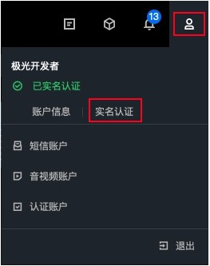

#实名认证
极光实名认证分为个人实名认证和企业实名认证，认证方式不同可使用的短信服务产品功能有所区别。 

个人实名认证：表示该账号使用者为用户个人。 
企业实名认证：表示该账号为单位账号，单位可以是企业、政府（含企业、政府、事业单位、团体、组织）。 

如果您当前为个人实名认证账户，可以参考个人认证升级为企业认证帮助升级为企业实名认证账户。

##个人认证和企业认证的权益区别

企业实名认证账号除具备个人实名认证账号的所有功能以外，还支持营销推广短信等扩展功能。详细的功能区别请见下表。

|类别|个人认证|企业认证|
|----|----|----|
|语音短信|支持|支持|
|行业短信|支持|支持|
|营销推广短信|不支持|支持|
|在线发送短信|支持|支持|

##如何操作实名认证

如下图所示，登录极光开发者服务控制台，将鼠标悬浮至用户图标处，在个人信息下拉框中点击 [实名认证](https://www.jiguang.cn/accounts/profile/developer_create)，即可去到认证页面，根据需求选择对应的认证类型即可。 
  

* 如果您当前为个人实名认证账户，可在 [开发者认证](https://www.jiguang.cn/accounts/profile/developer_info) 中升级为企业实名认证账户。