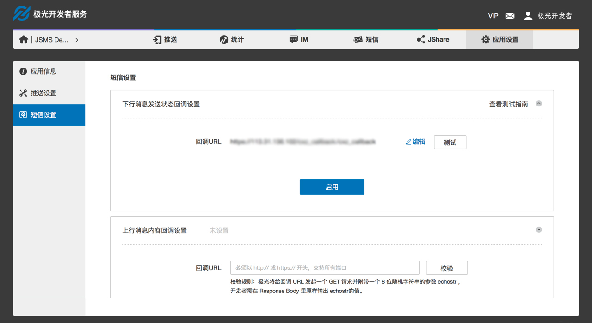

#回调接口
<div>
<ul>
    <li>设置并校验回调地址；</li>
    <li>回调消息格式说明；</li>
    <li>测试回调功能的方法；</li>
</ul>
</div>
</br>

## 设置回调地址
### 功能说明
- 设置并校验回调地址

###操作路径
Step1：登入控制台  
Step2：进入应用模版  
Step3：右侧菜单中选择［短信设置］  
Step4：点击选择需要使用的回调接口  


###设置回调地址
在控制台填写回调地址，回调地址必须以 http:// 或 https:// 开头，不支持自定义端口。填写回调地址后需校验通过后才可以使用，校验规则：极光将给回调 URL 发起一个 GET 请求并附带一个 8 位随机字符串的参数 echostr，开发者需要在 Response Body 里原样输出 echostr 的值。   

##回调消息格式
###回调方式说明
当有回调消息时，将采用 HTTP POST 的方式向开发者填写的回调 URL 提交通知消息。需要注意的是，如果回调失败，那么极光将会在一定的时间间隔后重试，最多重试三次。重试回调的时间间隔分别是 3 分钟、1 小时、12 小时。
###回调的基础参数如下
|KEY|REQUIRE|DESCRIPTION|
|----|----|----|
|nonce|Long|  随机长整数|    
|signature|  String|  签名，结合 appKey、appMasterSecret、nonce、timestamp 生成|
|timestamp|  Long|  当前时间戳，毫秒值|
|type|  String|  通知类型（SMS_REPORT/SMS_REPLY）|
|data|  String|  通知内容，json 字符串，开发者可以根据 type 反序列化 data|

###signature生成校验规则
* 将 appKey、appMasterSecret、nonce、timestamp 的值代入生成字符串 appKey={appKey}&appMasterSecret={appMasterSecret}&nonce={nonce}&timestamp={timestamp}；
* 对生成的字符串进行 sha1 加密；
* 开发者把接收到的 signature 和自己本地代码按照同样规则生成的签名作对比，如果一致，则可以认定此回调来自极光。

###下行消息送达状态回调参数

|CODE| TYPE| DESCRIPTION|
|----|----|----|
|msgId|	String| API 调用的时候返回的 msg_id|
|status| Integer| 发送状态返回码|
|receiveTime| Timestamp| 短信送达时间|
|phone|	String| 短信送达手机号|

###发送状态返回码

|CODE|DESCRIPTION|
|----|----|
|4001|发送成功|
|4002|被叫手机号码为运营商黑名单，需联系运营商处理|
|4003|手机终端问题，手机关机、停机等，请确认手机状态是否正常|
|4004|被叫手机号码为空号，请核实手机号码是否合规|
|4005|可发送短信余量不足|
|4006|发送超频，发送频率超过运营商限制|
|4007|未应答，语音短信状态，语音短信呼叫成功，用户未接听或拒绝接听|
|4008|用户正忙，语音短信状态，被叫用户正忙|
|4009|无法接通，语音短信状态，不在服务区、手机无信号或电话被转入来电提醒等|
|4100|其他错误|

###上行消息内容回调参数 

|CODE| TYPE| DESCRIPTION|
|---| ----| ----|
|phone| String| 主叫号码（用户手机号码）|
|replyTime| Date| 消息送达到极光平台的时间|
|content| String| 用户回复的消息内容|

###模板审核结果回调参数 

|CODE| TYPE| DESCRIPTION|
|---| ----| ----|
|tempId| Integer| 模板ID|
|status| Integer| 模板状态，1代表审核通过，2代表审核不通过|
|refuseReason| String| 审核不通过的原因|

###签名审核结果回调参数 

|CODE| TYPE| DESCRIPTION|
|---| ----| ----|
|signId| Integer| 签名ID|
|status| Integer| 签名状态，1代表审核通过，2代表审核不通过|
|refuseReason| String| 审核不通过的原因|

<a name="回调测试"></a>
##回调测试
### 功能说明
- 提供两种测试回调功能的方法：
 1. 控制台回调设置页面测试；
 2. curl 模拟 POST 回调请求；

###控制台回调设置页面测试
开发者点击回调设置页面中的测试按钮，极光将发起一次回调，将固定的测试数据回调到开发者提供的回调地址上。开发者可以通过检查是否收到回调请求，且接收到的数据是否与下面表格中一致以判断回调请求是否成功。  


###上行短信发送内容回调测试数据
|KEY| VALUE|
|----|----|
|content|	TD|
|phone|	13000000000|
|replyTime|	1492150740292|

###下行短信发送状态回调测试数据
|KEY| VALUE|
|----|----|
|msgId|	1857496|
|phone|	13000000000|
|receiveTime|	1492150740292|
|status|	4001|

###模板审核结果回调测试数据
|KEY| VALUE|
|----|----|
|tempId|	57496|
|status|	1|
|refuseReason| 	null|

###签名审核结果回调测试数据
|KEY| VALUE|
|----|----|
|signId|	123|
|status|	1|
|refuseReason| 	null|

###curl 模拟 POST 回调请求
在 linux 上可以很方便的使用 curl 命令发起 HTTP POST 请求，在 windows 下需要安装 curl 工具软件。以下是 curl 模拟回调的示例

###上行消息内容回调

```
curl -d "nonce=7659972084945889195&timestamp=1492150740274&signature=007eff6a105503211b472802eecc42465582ba70&type=SMS_REPLY&data＝{\"content\":\"TD\",\"phone\":\"13720481024\",\"replyTime\":1492150740292}" "http://localhost:8088/callback"

```

###下行消息发送状态回调

```
curl -d "nonce=7659972084945889195&timestamp=1492150740274&signature=007eff6a105503211b472802eecc42465582ba70&type=SMS_REPORT&data={\"msgId\":\"1652496\",\"phone\":\"15822889320\",\"receiveTime\":1492150741392,\"status\":4001}" "http://localhost:8088/callback"
```

###模板审核结果回调

```
curl -d "nonce=7659972084945889195&timestamp=1492150740274&signature=007eff6a105503211b472802eecc42465582ba70&type=SMS_TEMPLATE&data={\"tempId\":57496,\"status\":1,\"refuseReason\":null}" "http://localhost:8088/callback"
```

###签名审核结果回调

```
curl -d "nonce=7659972084945889195&timestamp=1492150740274&signature=007eff6a105503211b472802eecc42465582ba70&type=SMS_SIGN&data={\"signId\":57496,\"status\":1,\"refuseReason\":null}" "http://localhost:8088/callback"
```

###HttpClient 模拟 POST 回调请求

以下是 Java 语言使用 apache HttpClient 组件模拟回调的示例，使用前需引入以下 jar 包： 

***pom.xml***

```
     <dependency>
            <groupId>org.apache.httpcomponents</groupId>
            <artifactId>httpclient</artifactId>
            <version>4.5.2</version>
        </dependency>
        <dependency>
            <groupId>com.alibaba</groupId>
            <artifactId>fastjson</artifactId>
            <version>1.2.31</version>
        </dependency>   
```
 
***CallbackTest.java***

```

package cn.jiguang.sms.dev.sample;  
 
import com.alibaba.fastjson.JSON;
import org.apache.http.HttpResponse;
import org.apache.http.NameValuePair;
import org.apache.http.client.HttpClient;
import org.apache.http.client.entity.UrlEncodedFormEntity;
import org.apache.http.client.methods.HttpPost;
import org.apache.http.impl.client.HttpClients;
import org.apache.http.message.BasicNameValuePair;

import java.io.IOException;
import java.security.MessageDigest;
import java.security.NoSuchAlgorithmException;
import java.util.*;  
 
/**  
 * Created by jiguang on 2017/4/14.  
 */  
public class CallbackTest {
    private final static String URL = "http://localhost:8088/callback"; // 开发者将自己的回调URL写入
    private final static String APPKEY = "dev_sample_appKey";       // 开发者将自己的appKey写入
    private final static String APPMASTERSECRET = "dev_sample_appMasterSecret"; // 开发者将自己的appMasterSecret写入
    public static void main(String[] args) throws IOException {
        long nonce = new Random().nextLong();
        long timestamp = System.currentTimeMillis();
        String str = String.format("appKey=%s&appMasterSecret=%s&nonce=%s&timestamp=%s",
                APPKEY, APPMASTERSECRET, nonce, timestamp);
        String signature = encrypt(str);
        Map<String, Object> params = new HashMap<>();
        params.put("nonce", nonce);
        params.put("timestamp", timestamp);
        params.put("signature", signature);

        // 测试用户回复消息回调
        ReplyMessage replyMessage = new ReplyMessage();
        replyMessage.setPhone("13720481024");
        replyMessage.setReplyTime(new Date());
        replyMessage.setContent("TD");
        params.put("data", JSON.toJSONString(replyMessage));
        params.put("type", "SMS_REPLY");
        System.out.println("post params: " + JSON.toJSONString(params));
        sendPost(URL, params);

        // 测试短信送达状态回调
        ReportMessage reportMessage = new ReportMessage();
        reportMessage.setMsgId("1652496");
        reportMessage.setStatus(4001);
        reportMessage.setPhone("15822889320");
        reportMessage.setReceiveTime(new Date());
        params.put("data", JSON.toJSONString(reportMessage));
        params.put("type", "SMS_REPORT");
        System.out.println("post params: " + JSON.toJSONString(params));
        sendPost(URL, params);

        // 测试短信模板审核结果回调
        TemplateMessage templateMessage = new TemplateMessage();
        templateMessage.setTempId(57496);
        templateMessage.setStatus(1);
        templateMessage.setRefuseReason(null);
        params.put("data", JSON.toJSONString(templateMessage));
        params.put("type", "SMS_TEMPLATE");
        System.out.println("post params: " + JSON.toJSONString(params));
        sendPost(URL, params);
    }

    private static void sendPost(String url, Map<String, Object> params) throws IOException {
        HttpClient httpClient = HttpClients.custom().build();
        HttpPost httpPost = new HttpPost(url);
        List<NameValuePair> formParams = new ArrayList<>();
        for (Map.Entry<String, Object> entry : params.entrySet()) {
            formParams.add(new BasicNameValuePair(entry.getKey(), entry.getValue().toString()));
        }
        UrlEncodedFormEntity uefEntity = new UrlEncodedFormEntity(formParams, "UTF-8");
        httpPost.setEntity(uefEntity);
        HttpResponse response = httpClient.execute(httpPost);
        System.out.println("response: " + JSON.toJSONString(response));
    }

    private static class ReplyMessage {
        private String phone;
        private Date replyTime;
        private String content;
        public String getPhone() {
            return phone;
        }
        public void setPhone(String phone) {
            this.phone = phone;
        }
        public String getContent() {
            return content;
        }
        public void setContent(String content) {
            this.content = content;
        }
        public Date getReplyTime() {
            return replyTime;
        }
        public void setReplyTime(Date replayTime) {
            this.replyTime = replayTime;
        }
    }

    private static class ReportMessage {
        private String msgId;
        private Integer status;
        private String phone;
        private Date receiveTime;
        public String getMsgId() {
            return msgId;
        }
        public void setMsgId(String msgId) {
            this.msgId = msgId;
        }
        public Integer getStatus() {
            return status;
        }
        public void setStatus(Integer status) {
            this.status = status;
        }
        public String getPhone() {
            return phone;
        }
        public void setPhone(String phone) {
            this.phone = phone;
        }
        public Date getReceiveTime() {
            return receiveTime;
        }
        public void setReceiveTime(Date receiveTime) {
            this.receiveTime = receiveTime;
        }
    }

    private static class TemplateMessage {
        private Integer tempId;
        private Integer status;
        private String refuseReason;
        public Integer getTempId() {
            return tempId;
        }
        public void setTempId(Integer tempId) {
            this.tempId = tempId;
        }
        public Integer getStatus() {
            return status;
        }
        public void setStatus(Integer status) {
            this.status = status;
        }
        public String getRefuseReason() {
            return refuseReason;
        }
        public void setRefuseReason(String refuseReason) {
            this.refuseReason = refuseReason;
        }
    }

    /**
     * SHA1加密
     *
     * @param strSrc 明文
     * @return 加密之后的密文
     */
    public static String encrypt(String strSrc) {
        MessageDigest md = null;
        String strDes = null;
        byte[] bt = strSrc.getBytes();
        try {
            md = MessageDigest.getInstance("SHA-1");// 将此换成SHA-1、SHA-512、SHA-384等参数
            md.update(bt);
            strDes = bytes2Hex(md.digest()); // to HexString
        } catch (NoSuchAlgorithmException e) {
            return null;
        }
        return strDes;
    }

    /**
     * byte数组转换为16进制字符串
     *
     * @param bts 数据源
     * @return 16进制字符串
     */
    private static String bytes2Hex(byte[] bts) {
        String des = "";
        String tmp = null;
        for (int i = 0; i < bts.length; i++) {
            tmp = (Integer.toHexString(bts[i] & 0xFF));
            if (tmp.length() == 1) {
                des += "0";
            }
            des += tmp;
        }
        return des;
    }
}

```


