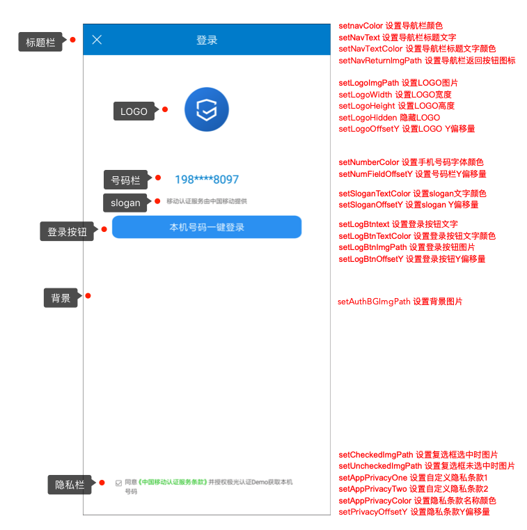

#Android SDK API

##SDK接口说明

* JVerificationInterface，包含SDK所有接口

##SDK初始化

###支持的版本
开始支持的版本 1.0.0

###接口定义

+ ***JVerificationInterface.init(Context context)***
	+ 接口说明：
		+ 初始化接口。建议在Application的onCreate中调用
	+ 参数说明：
		+ context：android的上下文
	+ 调用示例：

~~~
	JVerificationInterface.init(this);
~~~

##获取sdk初始化是否成功标识

### 支持的版本
开始支持的版本 2.3.2

### 接口的定义
+ ***JVerificationInterface.isInitSuccess()***
	+ 接口说明：
		+ 获取sdk是否整体初始化成功的标识
	+ 返回结果
	    + boolean : true - 成功，false - 失败
    + 调用示例：
    
~~~
	boolean isSuccess = JVerificationInterface.isInitSuccess();
~~~

##SDK设置debug模式

###支持的版本
开始支持的版本 1.0.0

###接口定义

+ ***JVerificationInterface.setDebugMode(boolean enable)***
	+ 接口说明：
		+ 设置是否开启debug模式。true则会打印更多的日志信息。建议在init接口之前调用。
	+ 参数说明：
		+ enable：debug开关
	+ 调用示例：

~~~
	JVerificationInterface.setDebugMode(true);
~~~

##SDK判断网络环境是否支持

###支持的版本
开始支持的版本 1.1.3

###接口定义

+ ***JVerificationInterface.checkVerifyEnable(Context context)***
	+ 接口说明：
		+ 判断当前的手机网络环境是否可以使用认证。
	+ 参数说明：
		+ context：android的上下文
	+ 返回说明：
		+ 返回true代表可以使用；返回false建议使用其他验证方式。
	+ 调用示例：

~~~
	boolean verifyEnable = JVerificationInterface.checkVerifyEnable(this);
        if(!verifyEnable){
            Log.d(TAG,"当前网络环境不支持认证");
            return;
        }
~~~

##SDK获取号码认证token（新）

###支持的版本
开始支持的版本 2.2.0

###接口定义
+ ***JVerificationInterface.getToken(Context context,int timeOut, VerifyListener listener)***
	+ 接口说明：
		+ 在预定时间内获取当前在线的sim卡所在运营商及token，如果超过所设时间，接口回调返回超时。如果获取成功代表可以用来验证手机号，获取失败则建议做短信验证。
	+ 参数说明：
		+ context：android的上下文
		+ timeOut: 超时时间（毫秒）,有效取值范围(0,10000],若小于等于0则取默认值5000.大于10000则取10000.为保证获取token的成功率，建议设置为3000-5000ms.
		+ listener：接口回调
	+ 回调说明：
    ***onResult(int code, String  content, String operator)***
  		+ code: 返回码，2000代表获取成功，其他为失败，详见错误码描述
    	+ content：成功时为token，可用于调用验证手机号接口。token有效期为1分钟，超过时效需要重新获取才能使用。失败时为失败信息
    	+ operator：成功时为对应运营商，CM代表中国移动，CU代表中国联通，CT代表中国电信。失败时可能为null
  	+ 调用示例：

~~~
	JVerificationInterface.getToken(this, 5000,new VerifyListner{
	    @Override
        public void onResult(int code, String content, String operator) {
	        if (code == 2000){
	            Log.d(TAG, "token=" + content + ", operator=" + operator);
            } else {
            	Log.d(TAG, "code=" + code + ", message=" + content);
            }
	    });
~~~

##SDK获取号码认证token（旧）

###支持的版本
开始支持的版本 1.0.0

###接口定义

+ ***JVerificationInterface.getToken(Context context, VerifyListener listener)***
	+ 接口说明：
		+ 获取当前在线的sim卡所在运营商及token。如果获取成功代表可以用来验证手机号，获取失败则建议做短信验证。默认超时时长为5000ms，此接口已废弃，建议使用新接口。
	+ 参数说明：
		+ context：android的上下文
		+ listener：接口回调
	+ 回调说明：
    ***onResult(int code, String  content, String operator)***
  		+ code: 返回码，2000代表获取成功，其他为失败，详见错误码描述
    	+ content：成功时为token，可用于调用验证手机号接口。token有效期为1分钟，超过时效需要重新获取才能使用。失败时为失败信息
    	+ operator：成功时为对应运营商，CM代表中国移动，CU代表中国联通，CT代表中国电信。失败时可能为null
  	+ 调用示例：

~~~
	JVerificationInterface.getToken(this, new VerifyListner{
	    @Override
        public void onResult(int code, String content, String operator) {
	        if (code == 2000){
	            Log.d(TAG, "token=" + content + ", operator=" + operator);
            } else {
            	Log.d(TAG, "code=" + code + ", message=" + content);
            }
	    });
~~~
***说明***：开发者可以通过SDK获取token接口的回调信息来选择验证方式，若成功获取到token则可以继续使用极光认证进行号码验证；若获取token失败，需要换用短信验证码等方式继续完成验证。

##SDK发起号码认证

###支持的版本
开始支持的版本 1.0.0

###接口定义

+ ***JVerificationInterface.verifyNumber(Context context, String token, String phone, VerifyListener listener)***
	+ 接口说明：
    	+ 验证手机号是否是当前在线的sim卡的手机号
  	+ 参数说明：
    	+ context：android的上下文
		+ token：选填，getToken接口返回的token。如果传空，将自动调用getToken方法再执行手机号验证
		+ phone：必填，需要验证的手机号。如果传空会报4001参数错误
		+ listener：接口回调
  	+ 回调说明：
  	***onResult(int code, String  content, String operator)***
		+ code: 返回码，1000代表验证一致，1001代表验证不一致，其他为失败，详见错误码描述
		+ content：返回码的解释信息
		+ operator：成功时为对应运营商，CM代表中国移动，CU代表中国联通，CT代表中国电信。失败时可能为null
  	+ 调用示例：

~~~
	JVerificationInterface.verifyNumber(this, null, "13512341234", new VerifyListner{
	    @Override
        public void onResult(int code, String content, String operator) {
	        if (code == 1000){
	            Log.d(TAG, "verify consistent, operator=" + operator);
            } else if (code == 1001) {
            	Log.d(TAG, "verify not consistent");
            } else {
                Log.d(TAG, "code=" + code + ", message=" + content);
            }
	    });
~~~

***说明***：开发者调用该接口，需要在管理控制台找到该应用，并在［认证设置］-［其他设置］中开启［SDK发起认证］，建议从开发者服务端发起号码认证。

## SDK一键登录预取号

###支持的版本
开始支持的版本 2.2.0

###接口定义
+ ***JVerificationInterface.preLogin(Context context, int timeOut, PreLoginListener listener){***
	+ 接口说明：
		+ 验证当前运营商网络是否可以进行一键登录操作，该方法会缓存取号信息，提高一键登录效率。建议发起一键登录前先调用此方法。
	+ 参数说明：
		+ context：android的上下文
		+ timeOut: 超时时间（毫秒）,有效取值范围(0,10000],若小于等于0则取默认值5000.大于10000则取10000, 为保证预取号的成功率，建议设置为3000-5000ms.
		+ listener：接口回调
	+ 回调说明：
    ***onResult(int code, String  content)***
  		+ code: 返回码，7000代表获取成功，其他为失败，详见错误码描述
    	+ content：调用结果信息描述
  	+ 调用示例：

~~~
        JVerificationInterface.preLogin(this, 5000,new PreLoginListener() {
            @Override
            public void onResult(final int code, final String content) {
                Log.d(TAG,"[" + code + "]message=" +  content );
            }
        });
~~~

##SDK请求授权一键登录（新）

### 支持的版本
开始支持的版本 2.3.0

### 接口的定义
+ ***JVerificationInterface.loginAuth(final Context context, boolean autoFinish, final VerifyListener listener)***
	+ 接口说明：
		+ 调起一键登录授权页面，在用户授权后获取loginToken
	+ 参数说明：
		+ context：android的上下文
		+ boolean：是否自动关闭授权页，true - 是，false - 否；若此字段设置为false，请在收到一键登录回调后调用SDK提供的关闭授权页面方法。
		+ listener：接口回调
    + 回调说明：
    ***onResult(int code, String  content, String operator)***
        + code: 返回码，6000代表loginToken获取成功，6001代表loginToken获取失败，其他返回码详见描述
        + content：返回码的解释信息，若获取成功，内容信息代表loginToken。
        + operator：成功时为对应运营商，CM代表中国移动，CU代表中国联通，CT代表中国电信。失败时可能为null
	+ 调用示例：

~~~
	JVerificationInterface.loginAuth(this, false, new VerifyListener() {
         @Override
              public void onResult(int code, String content, String operator) {
                 if (code == 6000){
                    Log.d(TAG, "code=" + code + ", token=" + content+" ,operator="+operator);
                }else{
                    Log.d(TAG, "code=" + code + ", message=" + content);
                }
              }
          });
~~~

***说明***：获取到一键登录的loginToken后，将其返回给应用服务端，从服务端调用[REST API](https://docs.jiguang.cn/jverification/server/rest_api/loginTokenVerify_api/)来获取手机号码

##SDK请求授权一键登录（旧）

### 支持的版本
开始支持的版本 2.0.0

### 接口的定义
+ ***JVerificationInterface.loginAuth(final Context context, final VerifyListener listener)***
	+ 接口说明：
		+ 调起一键登录授权页面，在用户授权后获取loginToken
	+ 参数说明：
		+ context：android的上下文
		+ listener：接口回调
	+ 回调说明：
    ***onResult(int code, String  content, String operator)***
		+ code: 返回码，6000代表loginToken获取成功，6001代表loginToken获取失败，其他返回码详见描述
		+ content：返回码的解释信息，若获取成功，内容信息代表loginToken。
		+ operator：成功时为对应运营商，CM代表中国移动，CU代表中国联通，CT代表中国电信。失败时可能为null
		+ 调用示例：
	
~~~			
	JVerificationInterface.loginAuth(this, new VerifyListener() {
         @Override
              public void onResult(int code, String content, String operator) {
                 if (code == 6000){
                    Log.d(TAG, "code=" + code + ", token=" + content+" ,operator="+operator);
                }else{
                    Log.d(TAG, "code=" + code + ", message=" + content);
                }
              }
          });
~~~

##SDK关闭授权页面

### 支持的版本
开始支持的版本 2.3.0

### 接口的定义
+ ***JVerificationInterface.dismissLoginAuthActivity()***
	+ 接口说明：
		+ 关闭登录授权页，如果当前授权正在进行，则loginAuth接口会立即触发6002取消回调。
	+ 调用示例：

~~~
	JVerificationInterface.dismissLoginAuthActivity();
~~~

##SDK自定义授权页面UI样式

### 支持的版本
开始支持的版本 2.1.0
   
### 接口的定义

+ ***JVerificationInterface.setCustomUIWithConfig(JVerifyUIConfig uiConfig)***
	+ 接口说明：
		+ 修改授权页面主题，开发者可以通过 setCustomUIWithConfig 方法修改授权页面主题，需在 *loginAuth* 接口之前调用
	+ 参数说明：
		+ uiConfig：主题配置对象，开发者在JVerifyUIConfig.java类中调用对应的方法配置授权页中对应的元素
	+ 调用示例：

~~~
    JVerifyUIConfig uiConfig = new JVerifyUIConfig.Builder()
                    .setAuthBGImgPath("main_bg")   
                    .setNavColor(0xff0086d0)
                    .setNavText("登录")
                    .setNavTextColor(0xffffffff)
                    .setNavReturnImgPath("umcsdk_return_bg")
                    .setLogoWidth(70)
                    .setLogoHeight(70)
                    .setLogoHidden(false)
                    .setNumberColor(0xff333333)
                    .setLogBtnText("本机号码一键登录")
                    .setLogBtnTextColor(0xffffffff)
                    .setLogBtnImgPath("umcsdk_login_btn_bg")
                    .setAppPrivacyOne("应用自定义服务条款一","https://www.jiguang.cn/about")
                    .setAppPrivacyTwo("应用自定义服务条款二","https://www.jiguang.cn/about")
                    .setAppPrivacyColor(0xff666666,0xff0085d0)
                    .setUncheckedImgPath("umcsdk_uncheck_image")
                    .setCheckedImgPath("umcsdk_check_image")
                    .setSloganTextColor(0xff999999)
                    .setLogoOffsetY(50)
                    .setLogoImgPath("logo_cm")
                    .setNumFieldOffsetY(170)
                    .setSloganOffsetY(230)
                    .setLogBtnOffsetY(254)
                    .addCustomView(mBtn, true, new JVerifyUIClickCallback() {
                        @Override
                        public void onClicked(Context context, View view) {
                            Toast.makeText(context,"动态注册的其他按钮",Toast.LENGTH_SHORT).show();
                        }
                    }).addCustomView(mBtn2, false, new JVerifyUIClickCallback() {
                        @Override
                        public void onClicked(Context context, View view) {
                            Toast.makeText(context,"动态注册的其他按钮222",Toast.LENGTH_SHORT).show();
                        }
                    })
                    .setPrivacyOffsetY(30).build();
    JVerificationInterface.setCustomUIWithConfig(uiConfig);

~~~

##SDK授权页面添加自定义控件

### 支持的版本
开始支持的版本 2.1.0
   
### 接口的定义

+ ***addCustomView(View view, boolean finishFlag,JVerifyUIClickCallback callback)***

	+ 接口说明： 
		+ 在授权页面添加自定义控件
	+ 参数说明：
		+ view：开发者传入自定义的控件，开发者需要提前设置好控件的布局属性，SDK只支持RelativeLayout布局
		+ finishFlag：是否在授权页面通过自定义控件的点击finish授权页面
		+ callback： 自定义控件的点击回调
	+ 回调说明： ***onClicked(Context context, View view)***               
		+ context：android的上下文
		+ view：自定义的控件的对象
       
	+ 调用示例：
	
~~~
        Button mBtn = new Button(this);
        mBtn.setText("其他方式登录");
        RelativeLayout.LayoutParams mLayoutParams1 = new RelativeLayout.LayoutParams(RelativeLayout.LayoutParams.WRAP_CONTENT,RelativeLayout.LayoutParams.WRAP_CONTENT);
        mLayoutParams1.setMargins(0, LoginUIHelper.dp2Pix(this,450.0f),0,0);
        mBtn.setLayoutParams(mLayoutParams1);
        new JVerifyUIConfig.Builder().addCustomView(mBtn, true, new JVerifyUIClickCallback() {
                        @Override
                        public void onClicked(Context context, View view) {
                            Toast.makeText(context,"动态注册的其他按钮",Toast.LENGTH_SHORT).show();
                        }
                    });                                    
        
~~~

##SDK授权页面顶部导航栏添加自定义控件

### 支持的版本
开始支持的版本 2.3.2

### 接口的定义

+ ***addNavControlView(View view, JVerifyUIClickCallback callback)***

	+ 接口说明：
	   + 在授权页中顶部导航栏添加自定义控件
	+ 参数说明：
       + view：开发者传入自定义的控件，开发者需要提前设置好控件的布局属性，SDK只支持RelativeLayout布局
       + callback： 自定义控件的点击回调
   + 回调说明：
      + ***onClicked(Context context, View view)***
         + context：android的上下文
         + view：自定义的控件的对象

	+ 调用示例：

~~~
        Button navBtn = new Button(this);
        navBtn.setText("导航栏按钮");
        RelativeLayout.LayoutParams navBtnParam = new RelativeLayout.LayoutParams(RelativeLayout.LayoutParams.WRAP_CONTENT,RelativeLayout.LayoutParams.WRAP_CONTENT);
        navBtnParam.addRule(RelativeLayout.ALIGN_PARENT_RIGHT,RelativeLayout.TRUE);
        navBtn.setLayoutParams(navBtnParam);
        new JVerifyUIConfig.Builder().addNavControlView(navBtn, new JVerifyUIClickCallback() {
                        @Override
                        public void onClicked(Context context, View view) {
                            Toast.makeText(context,"导航栏按钮点击",Toast.LENGTH_SHORT).show();
                        }
                    });

~~~

##JVerifyUIConfig配置元素说明

+ 授权页背景
    + 开始支持的版本：2.1.1
    + 说明：
        + 图片会默认拉伸铺满整个屏幕，建议使用 .9.png 格式的图片来解决不同尺寸屏幕的适配问题 

|方法|参数类型|说明|
|:-----:|:----:|:----:|
|setAuthBGImgPath|String|设置背景图片|

+ 授权页导航栏
        
|方法|参数类型|说明|
|:-----:|:----:|:----:|
|setNavColor|int|设置导航栏颜色|
|setNavText|String|设置导航栏标题文字|
|setNavTextColor|int|设置导航栏标题文字颜色|
|setNavReturnImgPath|String|设置导航栏返回按钮图标|
|setNavTransparent|boolean|设置导航栏背景是否隐藏，默认不透明。since 2.3.2|

       
+ 授权页logo
       
|方法|参数类型|说明|
|:-----:|:----:|:----:|
|setLogoWidth|int|设置logo宽度（单位：dp）|
|setLogoHeight|int|设置logo高度（单位：dp）|
|setLogoHidden|boolean|隐藏logo|
|setLogoOffsetY|int|设置logo相对于标题栏下边缘y偏移|
|setLogoImgPath|String|设置logo图片|
       
+ 授权页号码栏
       
|方法|参数类型|说明|
|:-----:|:----:|:----:|
|setNumberColor|int|设置手机号码字体颜色|
|setNumberSize|Number|设置手机号码字体大小（单位：sp）。since 2.3.2|
|setNumFieldOffsetY|int|设置号码栏相对于标题栏下边缘y偏移|
       
+ 授权页登录按钮
       
|方法|参数类型|说明|
|:-----:|:----:|:----:|
|setLogBtnText|String|设置登录按钮文字|
|setLogBtnTextColor|int|设置登录按钮文字颜色|       
|setLogBtnImgPath|String|设置授权登录按钮图片|
|setLogBtnOffsetY|int|设置登录按钮相对于标题栏下边缘y偏移|
       
+ 授权页隐私栏
       
|方法|参数类型|说明|
|:-----:|:----:|:----:|
|setAppPrivacyOne|String,String|设置开发者隐私条款1名称和URL(名称，url)|
|setAppPrivacyTwo|String,String|设置开发者隐私条款2名称和URL(名称，url)|       
|setAppPrivacyColor|int,int|设置隐私条款名称颜色(基础文字颜色，协议文字颜色)|
|setPrivacyOffsetY|int|设置隐私条款相对于授权页面底部下边缘y偏移|       
|setCheckedImgPath|String|设置复选框选中时图片|
|setUncheckedImgPath|String|设置复选框未选中时图片|  
|setPrivacyState|boolean|设置隐私条款默认选中状态，默认不选中。since 2.3.2|
       
+ 授权页slogan 
       
|方法|参数类型|说明|
|:-----:|:----:|:----:|
|setSloganTextColor|int|设置移动slogan文字颜色|
|setSloganOffsetY|int|设置slogan相对于标题栏下边缘y偏移|
       
+ 开发者自定义控件
       
|方法|参数类型|说明|
|:-----:|:----:|:----:|
|addCustomView|见以上方法定义|在授权页空白处添加自定义控件以及点击监听|
|addNavControlView|见以上方法定义|在授权页面顶部导航栏添加自定义控件以及点击监听|

       
##错误码

|code|message|备注|
|:-----:|:----:|:-----:|
|1000|verify consistent|手机号验证一致|
|1001|verify not consistent|手机号验证不一致|
|1002|unknown result|未知结果|
|1003|token expired|token失效|
|1004|sdk verify has been closed|SDK发起认证未开启|
|1005|包名和 AppKey 不匹配|请检查客户端配置的包名与官网对应 Appkey 应用下配置的包名是否一致|
|1006|frequency of verifying single number is beyond the maximum limit|同一号码自然日内认证消耗超过限制|
|1007|beyond daily frequency limit|appKey自然日认证消耗超过限制|
|1008|AppKey 非法|请到官网检查此应用信息中的 appkey，确认无误|
|1009||请到官网检查此应用的应用详情；更新应用中集成的极光SDK至最新|
|1010|verify interval is less than the minimum limit|同一号码连续两次提交认证间隔过短|
|1011|appSign invalid|应用签名错误，检查签名与Portal设置的是否一致|
|2000|内容为token|获取token成功|
|2001|fetch token failed|获取token失败|
|2002|init failed|SDK初始化失败|
|2003|network not reachable|网络连接不通|
|2004|get uid failed|极光服务注册失败|
|2005|request timeout|请求超时|
|2006|fetch config failed|获取应用配置失败|
|2007|内容为异常信息|验证遇到代码异常|
|2008|Token requesting, please try again later|正在获取token中，稍后再试|
|2009|verifying, please try again later|正在认证中，稍后再试 |
|2010|don't have READ_PHONE_STATE permission|未开启读取手机状态权限|
|2011|内容为异常信息|获取配置时代码异常|
|2012|内容为异常信息|获取token时代码异常|
|2013|内容为具体错误原因|网络发生异常|
|2014|internal error while requesting token|请求token时发生内部错误|
|2016|network type not supported|当前网络环境不支持认证|
|4001|parameter invalid|参数错误。请检查参数，比如是否手机号格式不对|
|4018||没有足够的余额|
|4031||不是认证SDK用户|
|4032||获取不到用户配置|
|4033|appkey is not support login|不是一键登录用户|
|5000|bad server|服务器未知错误|
|6000|内容为token|获取loginToken成功|
|6001|fetch loginToken failed|获取loginToken失败|
|6002|fetch loginToken canceled|用户取消获取loginToken|
|6003|UI 资源加载异常|未正常添加sdk所需的资源文件|
|6004|authorization requesting, please try again later|正在登录中，稍后再试|
|7000|preLogin success|sdk 预取号成功|
|7001|preLogin failed|sdk 预取号失败|
|7002|preLogin requesting, please try again later|正在预取号中，稍后再试|
|-994|网络连接超时|   |
|-996|网络连接断开|   |
|-997|注册失败/登录失败|（一般是由于没有网络造成的）如果确保设备网络正常，还是一直遇到此问题，则还有另外一个原因：JPush 服务器端拒绝注册。而这个的原因一般是：你当前 App 的 Android 包名以及 AppKey，与你在 Portal 上注册的应用的 Android 包名与 AppKey 不相同。|
