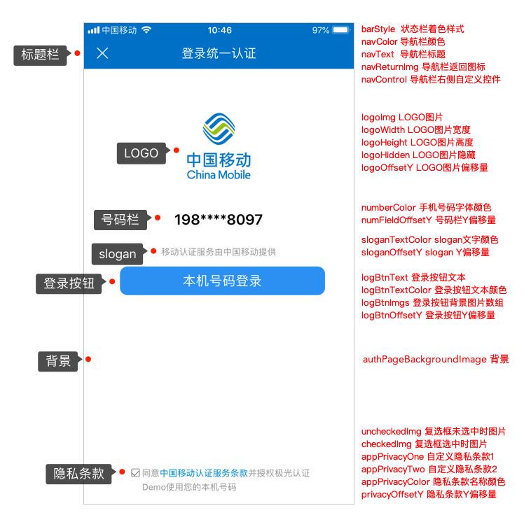

#iOS SDK API

##SDK接口说明

1. JVERIFICATIONService，包含SDK所有接口
2. JVAuthConfig类，应用配置信息类
3. VAuthEntity类，认证实体类
4. JVUIConfig类，登录界面UI配置基类
5. JVMobileUIConfig类，JVUIConfig的子类，移动登录界面UI配置类
6. JVUnicomUIConfig类，JVUIConfig的子类，联通登录界面UI配置类
7. JVTelecomUIConfig类，JVUIConfig的子类，电信登录界面UI配置类

##SDK初始化

###支持的版本
开始支持的版本 1.0.0

###接口定义

+ ***+  setupWithConfig:(JVAuthConfig * )config;***

    + 接口说明:
        + 初始化接口
    + 参数说明
        + config 配置类
    + 调用示例:

~~~
    // 如需使用 IDFA 功能请添加此代码并在初始化配置类中设置 advertisingId
    NSString *idfaStr = [[[ASIdentifierManager sharedManager] advertisingIdentifier] UUIDString];
    
    JVAuthConfig *config = [[JVAuthConfig alloc] init];
    config.appKey = @"a0e6ace8d5b3e0247e3f58db";
    config.advertisingId = idfaStr;
    [JVERIFICATIONService setupWithConfig:config];
~~~

##SDK获取初始化状态

###支持的版本
开始支持的版本 2.3.2

+ **+ (BOOL)isSetupClient**

	+ 接口说明:
		+ 初始化是否完成
	+  返回值说明
		+ YES 初始化完成
		+ NO 初始化未完成
	+ 调用示例:

~~~
BOOL isSetupClient = [JVERIFICATIONService isSetupClient];
if (isSetupClient) {
//初始化完成，可以进行后续操作
}
~~~

##SDK设置debug模式

###支持的版本
开始支持的版本 1.0.0

###接口定义

+ ***+  (void)setDebug:(BOOL)enable;***
    + 接口说明:
        + 开启debug模式
    +  参数说明
        + enable 是否开启debug模式

##SDK判断网络环境是否支持

###支持的版本
开始支持的版本 1.1.2

###接口定义

+ ***+ (BOOL)checkVerifyEnable;***
    + 接口说明:
        + 判断当前网络环境是否可以发起认证
    +  返回值说明
        + YES 可以认证
        + NO 不可以认证
        
    + 调用示例:

~~~
    if(![JVERIFICATIONService checkVerifyEnable]) {
        NSLog(@"当前网络环境不支持认证！");
        return;
    }
    //继续获取token操作
    ...
~~~

##SDK获取号码认证token（新）

###支持的版本
开始支持的版本 2.2.0

+ **+ (void)getToken:(NSTimeInterval)timeout completion:(void (^)(NSDictionary * result))completion;**

    + 接口说明:
        + 获取手机号校验token
    + 参数说明
        + completion  参数是字典 返回token 、错误码等相关信息，token有效期1分钟, 一次认证后失效
        + result 字典 获取到token时key有operator、code、token字段，获取不到token是key为code和content字段
        + timeout 超时时间（毫秒）,有效取值范围(0,10000],若小于等于0则取默认值5000.大于10000则取10000.为保证获取token的成功率，建议设置为3000-5000ms.

    + 调用示例:
    + 
~~~
    [JVERIFICATIONService getToken:(NSTimeInterval)timeout completion:^(NSDictionary *result) {
        NSLog(@"getToken result:%@", result)
        //TODO:获取token后相关操作
    }];
~~~

##SDK获取号码认证token（旧）

###支持的版本
开始支持的版本 1.0.0

###接口定义

+ ***+ (void)getToken:(void (^)(NSDictionary * result))completion;***

    + 接口说明:
        + 获取号码认证token，此接口已废弃，建议使用新接口
    + 参数说明
        + completion  参数是字典 返回token、错误码等相关信息，token一次认证后失效
        + result 字典 获取到token时key有operator、code、token字段，获取不到token时key为code和content字段

    + 调用示例:

~~~
    [JVERIFICATIONService getToken:^(NSDictionary *result) {
        NSLog(@"getToken result:%@", result)
        //TODO:获取token后相关操作
    }];
~~~

***说明***：开发者可以通过SDK获取token接口的回调信息来选择验证方式，若成功获取到token则可以继续使用极光认证进行号码验证；若获取token失败，需要换用短信验证码等方式继续完成验证。

##SDK发起号码认证

###支持的版本
开始支持的版本 1.0.0

###接口定义

+ ***+ (void)verifyNumber:(JVAuthEntity * )entity result:(void (^)(NSDictionary * result))completion;***

    + 接口说明:
        + 发起号码认证，验证手机号码和本机SIM卡号码是否一致
    + 参数说明:
        + completion 认证结果
        + result 字典 key为code和content两个字段
        + entity 认证实体类

    + 调用示例:

~~~
    JVAuthEntity *entity = [[JVAuthEntity alloc] init];
    entity.number = @"phone number";
    entity.token = @"your token";
    [JVERIFICATIONService verifyNumber:entity result:^(NSDictionary *result) {
        NSLog(@"verify result:%@", result);
    }];
~~~

***说明***：开发者调用该接口，需要在管理控制台找到该应用，并在［认证设置］-［其他设置］中开启［SDK发起认证］，建议从开发者服务端发起号码认证。

##SDK登录预取号

###支持的版本
开始支持的版本 2.2.0

+ ***+ (void)preLogin:(NSTimeInterval)timeout completion:(void (^)(NSDictionary *result))completion***

    + 接口说明:
        + 验证当前运营商网络是否可以进行一键登录操作，该方法会缓存取号信息，提高一键登录效率。建议发起一键登录前先调用此方法。
    + 参数说明:
        + completion 预取号结果
        + result 字典 key为code和message两个字段
        + timeout 超时时间（毫秒）,有效取值范围(0,10000],若小于等于0则取默认值5000.大于10000则取10000.为保证获取token的成功率，建议设置为3000-5000ms.

    + 调用示例:

~~~
    [JVERIFICATIONService preLogin:5000 completion:^(NSDictionary *result) {
        NSLog(@"登录预取号 result:%@", result);
    }];
~~~

##SDK请求授权一键登录（新）

###支持的版本
开始支持的版本 2.3.0

+ **+ (void)getAuthorizationWithController:(UIViewController *)vc hide:(BOOL)hide completion:(void (^)(NSDictionary *result))completion**

    + 接口说明:
        + 授权一键登录
    + 参数说明:
        + completion 登录结果
        + result 字典 获取到token时key有operator、code、loginToken字段，获取不到token是key为code和content字段
        + vc 当前控制器
        + hide 完成后是否自动隐藏授权页，默认YES。若此字段设置为NO，请在收到一键登录回调后调用SDK提供的关闭授权页面方法。

    + 调用示例:

~~~
    [JVERIFICATIONService getAuthorizationWithController:self hide:YES completion:^(NSDictionary *result) {
        NSLog(@"一键登录 result:%@", result);
    }];
~~~

***说明***：获取到一键登录的loginToken后，将其返回给应用服务端，从服务端调用[REST API](https://docs.jiguang.cn/jverification/server/rest_api/loginTokenVerify_api/)来获取手机号码

##SDK请求授权一键登录（旧）

###支持的版本
开始支持的版本 2.0.0

###接口定义

+ ***+ (void)getAuthorizationWithController:(UIViewController *)vc completion:(void (^)(NSDictionary *result))completion***

    + 接口说明:
        + 授权一键登录
    + 参数说明:
        + completion 登录结果
        + result 字典 获取到loginToken时key有operator、code、loginToken字段，获取不到loginToken时key为code和content字段
        + vc 当前控制器

    + 调用示例:

~~~
    [JVERIFICATIONService getAuthorizationWithController:self completion:^(NSDictionary *result) {
        NSLog(@"一键登录 result:%@", result);
    }];
~~~

##SDK关闭授权页面

###支持的版本
开始支持的版本 2.3.0

+ **+ (void)dismissLoginController;**

    + 接口说明:
        + 关闭授权页

    + 调用示例:

~~~
    [JVERIFICATIONService dismissLoginController];
~~~

##SDK自定义授权页面UI样式

###支持的版本
开始支持的版本 2.0.0

###接口定义

+ ***+ (void)customUIWithConfig:(JVUIConfig *)UIConfig;***

    + 接口说明:
        + 自定义授权页面UI样式
    + 参数说明:
        + UIConfig JVUIConfig的子类

    + 调用示例:

~~~
    /*移动*/
    JVMobileUIConfig *mobileUIConfig = [[JVMobileUIConfig alloc] init];
    mobileUIConfig.logoImg = [UIImage imageNamed:@"logo"];
    [JVERIFICATIONService customUIWithConfig:mobileUIConfig];
    
    /*联通*/
    JVUnicomUIConfig *unicomUIConfig = [[JVUnicomUIConfig alloc] init];
    unicomUIConfig.logoImg = [UIImage imageNamed:@"logo"];
    [JVERIFICATIONService customUIWithConfig:unicomUIConfig];
    
    /*电信*/
    JVTelecomUIConfig *telecomUIConfig = [[JVTelecomUIConfig alloc] init];
    telecomUIConfig.logoImg = [UIImage imageNamed:@"logo"];
    [JVERIFICATIONService customUIWithConfig:telecomUIConfig];
~~~

##SDK授权页面添加自定义控件

###支持的版本
开始支持的版本 2.1.0

###接口定义

+ ***+ (void)customUIWithConfig:(JVUIConfig *)UIConfig customViews:(void(^)(UIView *customAreaView))customViewsBlk;***

    + 接口说明:
        + 自定义授权页面UI样式，并添加自定义控件
    + 参数说明:
        + UIConfig JVUIConfig的子类
        + customViewsBlk 添加自定义视图的block

    + 调用示例:

~~~
    /*移动*/
    JVMobileUIConfig *mobileUIConfig = [[JVMobileUIConfig alloc] init];
    mobileUIConfig.logoImg = [UIImage imageNamed:@"cmccLogo"];
    [JVERIFICATIONService customUIWithConfig:mobileUIConfig customViews:^(UIView *customAreaView) {
        //添加一个自定义label
        UILabel *lable  = [[UILabel alloc] init];
        lable.text = @"这是一个自定义label";
        [lable sizeToFit];
        lable.center = customAreaView.center;
        [customAreaView addSubview:lable];
    }];
    
    /*联通*/
    JVUnicomUIConfig *unicomUIConfig = [[JVUnicomUIConfig alloc] init];
    unicomUIConfig.logoImg = [UIImage imageNamed:@"cuccLogo"];
    [JVERIFICATIONService customUIWithConfig:unicomUIConfig customViews:^(UIView *customAreaView) {
        //添加自定义控件
    }];
    
    /*电信*/
    JVTelecomUIConfig *telecomUIConfig = [[JVTelecomUIConfig alloc] init];
    telecomUIConfig.logoImg = [UIImage imageNamed:@"ctccLogo"];
    telecomUIConfig.navColor = [UIColor redColor];
    telecomUIConfig.appPrivacyOne = @[@"自定义协议1",@"https://www.jiguang.cn/push"];
    telecomUIConfig.appPrivacyTwo = @[@"自定义协议2",@"https://www.jiguang.cn/media/news/143"];
    [JVERIFICATIONService customUIWithConfig:telecomUIConfig customViews:^(UIView *customAreaView) {
		//添加自定义控件
    }];
    
~~~

##JVAuthConfig类

应用配置信息类。以下是属性说明：

|参数名称|参数类型|参数说明|
|:-----:|:----:|:-----:|
|AppKey |NSString|极光系统应用唯一标识，必填|
|channel|NSString|应用发布渠道，可选|
|advertisingId|NSString|广告标识符，可选|
|isProduction|BOOL|是否生产环境。如果为开发状态，设置为NO；如果为生产状态，应改为YES。可选，默认为NO|

##JVAuthEntity类

认证实体类。包含认证的手机号和token。以下是属性说明：

|参数名称|参数类型|参数说明|
|:-----:|:----:|:-----:|
|number|NSString|认证手机号，必填|
|token|NSString|认证手机号码的授权码。可选，若为空，则sdk自动获取后再认证。|

##JVUIConfig类

登录界面UI配置基类。以下是属性说明：

|参数名称|参数类型|参数说明|
|:-----:|:----:|:-----:|
|authPageBackgroundImage|UIImage|授权页面背景图片|
|navColor|UIColor|导航栏颜色|
|barStyle|UIBarStyle|状态栏着色样式|
|navText|NSAttributedString|导航栏标题|
|navReturnImg|UIImage|导航返回图标|
|navControl|UIBarButtonItem|导航栏右侧自定义控件|
|navCustom|BOOL|导航栏是否隐藏|
|logoImg|UIImage|LOGO图片|
|logoWidth|CGFloat|LOGO图片宽度|
|logoHeight|CGFloat|LOGO图片高度|
|logoOffsetY|CGFloat|LOGO图片偏移量|
|logoHidden|BOOL|LOGO图片隐藏|
|logBtnText|NSString|登录按钮文本|
|logBtnOffsetY|CGFloat|登录按钮Y偏移量|
|logBtnTextColor|UIColor|登录按钮文本颜色|
|logBtnImgs|NSArray|登录按钮背景图片添加到数组(顺序如下) @[激活状态的图片,失效状态的图片,高亮状态的图片]|
|numberColor|UIColor|手机号码字体颜色|
|numberSize|CGFloat|手机号码字体大小|
|numFieldOffsetY|CGFloat|号码栏Y偏移量|
|uncheckedImg|UIImage|复选框未选中时图片|
|checkedImg|UIImage|复选框选中时图片|
|appPrivacyOne|NSArray|隐私条款一:数组（务必按顺序）@[条款名称,条款链接]|
|appPrivacyTwo|NSArray|隐私条款二:数组（务必按顺序）@[条款名称,条款链接]|
|appPrivacyColor|NSArray|隐私条款名称颜色 @[基础文字颜色,条款颜色]|
|privacyState|BOOL|隐私条款check框默认状态 默认:NO|
|privacyOffsetY |CGFloat|隐私条款Y偏移量(注:此属性为与屏幕底部的距离)|
|sloganOffsetY|CGFloat|slogan偏移量Y|
|sloganTextColor|UIColor|slogan文字颜色|

##JVMobileUIConfig类

移动登录界面UI配置类，JVUIConfig的子类。

##JVUnicomUIConfig类

联通登录界面UI配置类，JVUIConfig的子类。

##JVTelecomUIConfig类

电信登录界面UI配置类，JVUIConfig的子类。

##错误码列表

|code|描述|备注|
|:-----:|:----:|:-----:|
|1000 | verify consistent|手机号验证一致|
|1001 | verify not consistent|手机号验证不一致|
|1002 | unknown result|未知结果|
|1003 | token expired|token失效|
|1004 | sdk verify has been closed|SDK发起认证未开启|
|1005|AppKey 不存在|请到官网检查 Appkey 对应的应用是否已被删除|
|1006|frequency of verifying single number is beyond the maximum limit|同一号码自然日内认证消耗超过限制|
|1007|beyond daily frequency limit|appKey自然日认证消耗超过限制|
|1008|AppKey 非法|请到官网检查此应用详情中的 Appkey，确认无误|
|1009|当前的 Appkey 下没有创建 iOS 应用；你所使用的 JCore 版本过低|请到官网检查此应用的应用详情；更新应用中集成的 JCore 至最新。|
|1010|verify interval is less than the minimum limit|同一号码连续两次提交认证间隔过短|
|2000 | token request success |获取token 成功|
|2001 | fetch token error |获取token失败|
|2002 | sdk init failed |sdk初始化失败|
|2003 | netwrok not reachable |网络连接不通 |
|2004 | get uid failed |极光服务注册失败 |
|2005 | request timeout|请求超时|
|2006 | fetch config failed |获取配置失败|
|2008 | Token requesting, please wait|正在获取token中，稍后再试|
|2009 | verifying, please try again later|正在认证中，稍后再试 |
|2014 | internal error while requesting token|请求token时发生内部错误 |
|2015 | rsa encode failed|rsa加密失败 |
|2016|network type not supported|当前网络环境不支持认证|
|4001 ||参数错误。请检查参数，比如是否手机号格式不对|
|4009 ||解密rsa失败|
|4018 ||没有足够的余额|
|4031 ||不是认证用户|
|4032 ||获取不到用户配置|
|4033|appkey is not support login|不是一键登录用户|
|5000|bad server|服务器未知错误|
|6000|loginToken request success|获取loginToken成功|
|6001|fetch loginToken failed|获取loginToken失败|
|6002|login cancel|用户取消登录|
|6003|UI load error|UI加载异常|
|6004|authorization requesting, please try again later|正在登录中，稍候再试|
|7000|preLogin success|预取号成功|
|7001|preLogin failed|预取号失败|
|7002|preLogin requesting, please try again later|取号中|
