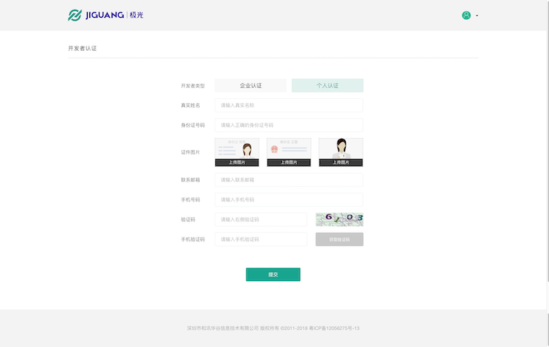
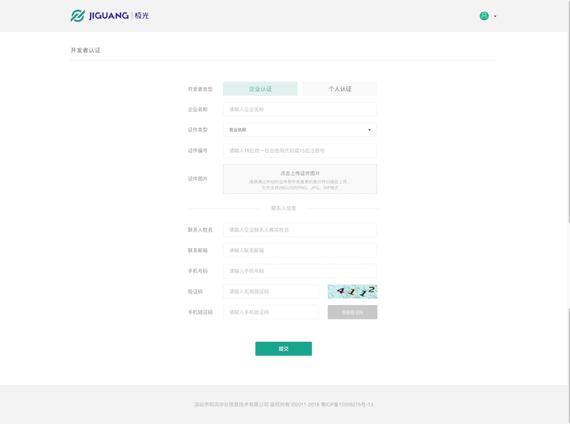
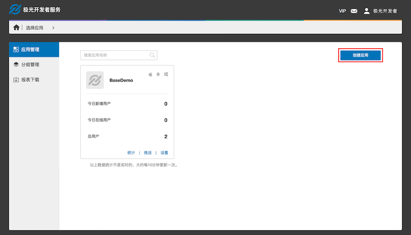
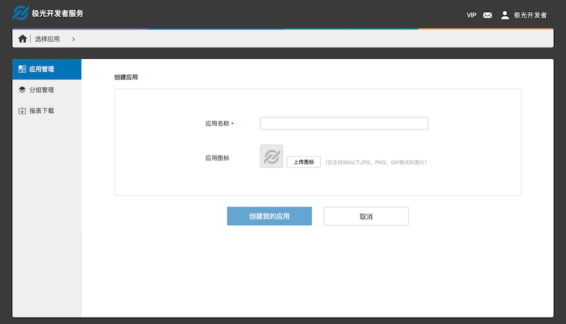

#控制台操作指南

##开发者认证

因运营商要求，认证业务需要完成个人实名认证或企业资质认证后使用。

###个人认证

支持个人开发者认证，认证内容均必填，且认证通过后不允许修改，请认真填写个人认证资料，避免影响日后使用短信业务。

**操作路径**

Step1：登入控制台 
Step2：进入[账户信息](https://www.jiguang.cn/accounts/profile) 
Step3：点击页面底部的[立即认证](https://www.jiguang.cn/accounts/profile/developer_create) 
Step4：开发者类型选择［个人认证］ 

###企业认证

支持企业开发者认证，认证内容均必填，且认证通过后不允许修改，请认真填写企业认证资料，避免影响日后使用短信、认证等业务。

**操作路径**

Step1：登入控制台 
Step2：进入[账户信息](https://www.jiguang.cn/accounts/profile) 
Step3：点击页面底部的[立即认证](https://www.jiguang.cn/accounts/profile/developer_create) 
Step4：开发者类型选择［企业认证］ 

##创建应用

**操作路径**

Step1：登入控制台 
Step2：点击［创建应用］按钮 

Step3：填写［应用名称］和［应用图标］，其中［应用名称］为必填。 

##认证设置

使用极光认证服务，需要开发者补充相关应用介绍，Android应用需要提交应用包名和应用签名，iOS应用需要提交Bundle ID，开发者若使用一键登录功能，还需要填写RSA加密公钥。在通过审核后方可使用认证服务，正常情况下审核周期为1个工作日。

**操作路径**

Step1：登入控制台 
Step2：选择要开通认证服务的应用，点击［应用设置］按钮 
Step3：左侧菜单栏选择［极光认证］ 
Step4：补充［应用分类］和［应用简介］并点击［保存］按钮，Android需填写［应用包名］和［应用标签］，iOS应用需填写［Bundle ID］，点击［提交审核］按钮 
Step5: 待Step4审核通过后，在［一键登录设置］中，选择开通的平台，并填写RSA加密公钥，点击［提交审核］按钮 

##查看数据

* ［认证统计］可以查看该应用的认证消耗情况，认证余量是开发者账号所有应用共享的认证可用次数；
* ［认证明细］可以查看该应用所有的认证记录。

##认证充值

**操作路径**

Step1：登入控制台 
Step2：点击右上角的账户按钮，进入[业务设置](https://www.jiguang.cn//account/verification_recharge) 
Step3：左侧菜单栏选择认证账户管理下的［账户充值］ 
Step4：输入要充值的数量，注意单位为“千条”，点击［提交订单］按钮 
Step5：在支付页面选择支付方式，支付后完成充值
